# Vue 01

> B站 Vue全家桶（BV1Zy4y1K7SH） 学习笔记

## 介绍

一套用于构建用户界面的渐进式JavaScript框架

- 特点

1、采用组件化模式，提高代码复用率，且让代码更好维护。

在Vue里面，一个.vue文件就是一个组件

2、声明式编码，让编码人员无需直接操作DOM，提高开发效率。

举例：如果有一组数据，想让他放入列表中。之前学过的方式叫命令式编码。

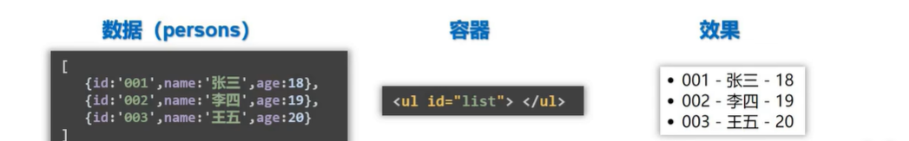

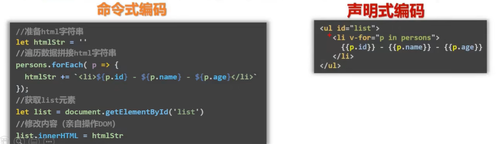

3、使用虚拟DOM+优秀的Diff算法，尽量复用DOM节点。

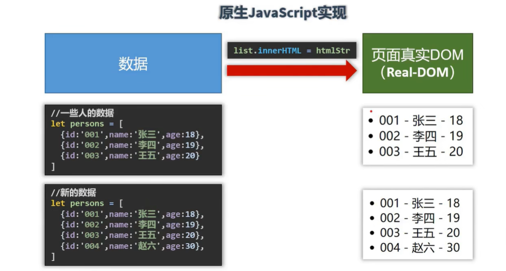

 原生JS中，更新数据其实是把新数据替换掉原本的老数据，把“张三李四王五”替换原本的“张三李四王五”。但其实可以保留“张三李四王五”。

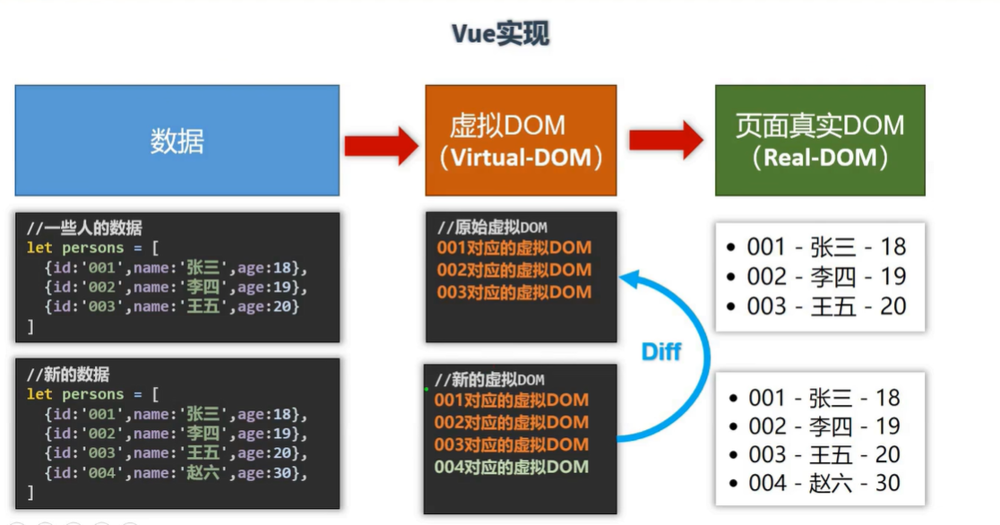

## 官方文档

Vue2

> [[Vue.js (vuejs.org)](https://v2.cn.vuejs.org/)](https://v2.cn.vuejs.org/v2/guide/installation.html)


## 安装

① script标签引入 ② npm引入（一般搭配 vue-cli）

目前先以 script引入

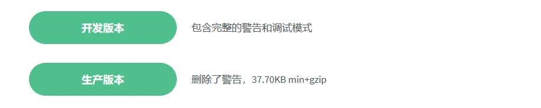

## 01 初步认识

```html
<!DOCTYPE html>
<html lang="en">
<head>
  <meta charset="UTF-8">
  <meta name="viewport" content="width=device-width, initial-scale=1.0">
  <title>Document</title>
  <!-- 引入vue -->
  <script src="../js/vue.js"></script>
  <!-- 引入之后多了一个vue对象，也可以是vue函数，因为我们把函数当作对象或者函数
  全局多了一个vue 构造函数 -->
</head>
<body>
  
</body>
</html>
```


**打开控制台：**

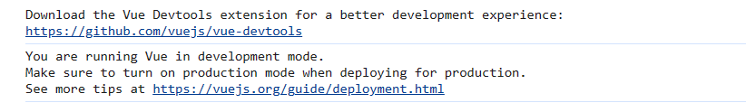

有两个提醒 ① 下载开发者工具 ② 确保你处在开发模式而非生产模式


**在控制台敲击 Vue ，验证我们引入之后多了一个构造函数**

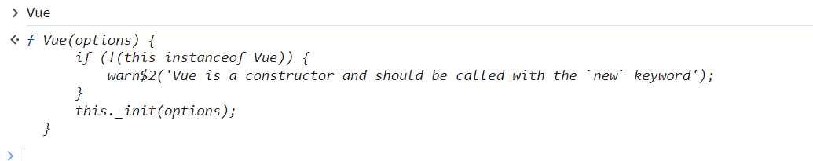 

<font color ="red">**处理提示：**</font>

① 管理扩展程序：

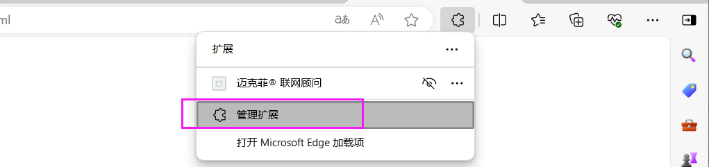

加入vue_dev_tools.crx

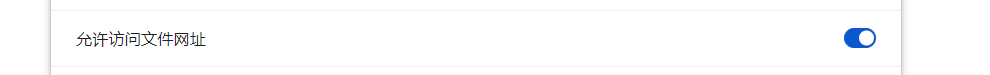

**②** 通过修改Vue的全局配置 ，处理提示

**【全局配置】：**`Vue.config` 是一个对象，包含 Vue 的全局配置。可以在启动应用之前修改它的 property。其中的 [productionTip](https://v2.cn.vuejs.org/v2/api/#productionTip) 设置为 `false` 以阻止 vue 在启动时生成生产提示。

```html
<script>
  Vue.config.productionTip = false
</script>
```

这里我修改了没变化，所以我在 下载的  vue.js 源码中改了


### 案例 1

```html
<!-- 引入vue -->
<script src="../js/vue.js"></script>
<!-- 引入之后多了一个vue对象，也可以是vue函数，因为我们把函数当作对象或者函数
  全局多了一个vue 构造函数 -->
  
<body>
  <div id="root">
    <h1>Hello {{name}}</h1>
  </div>
</body>
</html>
<script>
  //  全局多了一个vue 构造函数
  Vue.config.productionTip = false

  // 创建 Vue 实例
  // Vue构造函数中,只传一个参数,叫配置对象
  const x = new Vue({
    el: '#root', // el用于指定当前Vue实例为哪个容器服务，值通常为css选择器字符串。
    // el: document.getElementById('#root')
    data: {
      name: 'world'
    }
  })
</script>
```


### 总结

初识Vue:

1. 想让 Vue工作，就必须创建一个Vue实例，且要传入一个配置对象
2. root 容器里的代码依然符合html规范，只不过混入了一些特殊的 Vue语法
3. root 容器里的代码被称为【Vue模板】
4. Vue实例和容器是一一对应的;
5. 真实开发中只有一个Vue实例，并且会配合着组件一起使用;
6. {{xxx}}中的xxx要写js表达式，且xxx可以自动读取到data中的所有属性;
7. 一旦data中的数据发生改变，那么页面中用到该数据的地方也会自动更新;


## 02 模板语法

Vue模板语法有两大类：

1. 插值语法（双大括号表达式）
2. 指令语法（以 v-开头）

**① 插值语法**

1. 功能: 用于解析<font color="red">标签体**内容**</font>
2. 语法: {{xxx}} ，xxx 会作为 js 表达式解析

**② 指令语法**

1. 功能: 解析标签<font color="red">**属性**</font>、解析标签体内容、绑定事件
2. 举例：v-bind:href = 'xxxx' ，xxxx 会作为 js 表达式被解析
3. 说明：Vue 中有很多的指令，此处只是用 v-bind 举个例子

### v-bind

> V:\Web\Vue_\myCode_Vue2\vue_basic\02 Template Syntax\模板语法.html

```html
<script src="../js/vue.js"></script>
<body>
  <div id="root">
    <h1>插值语法</h1>
    <h3>你好,{{name}}</h3>
    <hr>
    <a v-bind:href="school.url">点我去{{school.name}}</a>
  </div>
</body>
</html>

<script>
  const x = new Vue({
    el: '#root',
    data: {
      name: 'Vue',
      school: {
        name: 'baidu1',
        url: 'http://www.baidu.com'
      }
    }
  })
</script>
```


## 03 数据绑定

单向数据绑定 One-way Data-Binding 

双向数据绑定 Two-way Data-Binding


 **Vue中有2种数据绑定的方式：**

​     1.单向绑定(v-bind)：数据只能从data流向页面。

​     2.双向绑定(v-model)：数据不仅能从data流向页面，还可以从页面流向data。

​      备注：

​        ① 双向绑定一般都应用在表单类元素上（如：input、select等）

​        ② v-model:value 可以简写为 v-model，因为v-model默认收集的就是value值。

 

```html
<script src="../js/vue.js"></script>

<body>
  <div id="root">
    单向数据绑定: <input type="text" v-bind:value="name"> <br>
    双向数据绑定: <input type="text" v-model:value="name">
      
      
    <!-- 如下代码是错误的，因为v-model只能应用在表单类元素上 (输入类元素)
        也就是value值 -->
    <h2 v-model:x="name">你好</h2>
  </div>
</body>
</html>

<script>
  const x = new Vue({
    el: '#root',
    data: {
      name:'hello world'
    }
  })
</script>
```

## 04 el和data的两种写法

  data与el的2种写法

​     1.el有2种写法

​         (1).new Vue时候配置el属性。

​         (2).先创建Vue实例，随后再通过vm.$mount('#root')指定el的值。

​     2.data有2种写法

​         (1).对象式

​         (2).函数式

如何选择：目前哪种写法都可以，以后学习到组件时，data必须使用函数式，否则会报错。

​     3.一个重要的原则：

​         <font color="Red">由Vue管理的函数，一定不要写箭头函数，一旦写了箭头函数，this就不再是Vue实例了，而是window。</font>

### 绑定容器的两种方法：el的两种写法

```vue
const x = new Vue({})
console.log(x)
```

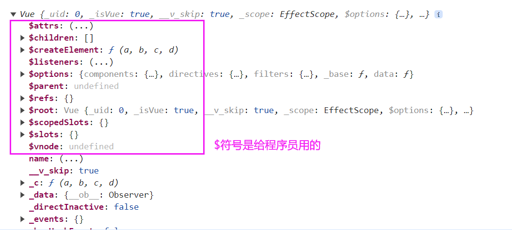

输出的是 x（vue的实例），

实例x的创造者（构造函数Vue），原型对象上的方法实例 x 都可以看见

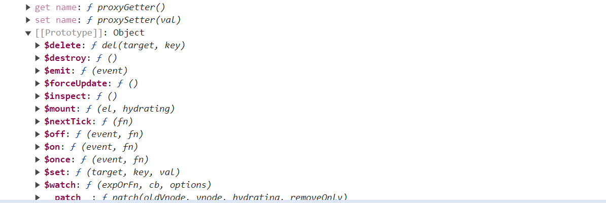

这里使用 $mount

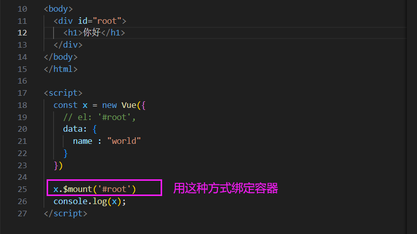

### data 的两种写法

- 第一种写法 对象是=式

```html
<body>
  <div id="root">
    <h1>你好</h1>
  </div>
</body>
</html>

<script>
  const x = new Vue({
    el: '#root',
    data: {
      name : "world"
    }
  })
</script>
```


- 第二种写法 函数式

data: function() {}  此处的this是vue对象，不能改成箭头函数

```javascript
  const x2 = new Vue({
    el: '#root',
    data: function() {
      console.log(this)  // 此处的this是vue对象
      return {
        name: 'world'
      }
    }
  })
  
  // 这里的可以简写为：
  const x3 = new Vue({
    el: '#root',
    data() {
      console.log(this)  // 此处的this是vue对象
      return {
        name: 'world'
      }
    }
  })
  
```

## 05 MVVM 模型

 MVVM pattern

1. M：模型(Model) ：对应 data 中的数据
2. V：视图(View) ：模板
3. VM：视图模型(ViewModel) ： Vue 实例对象

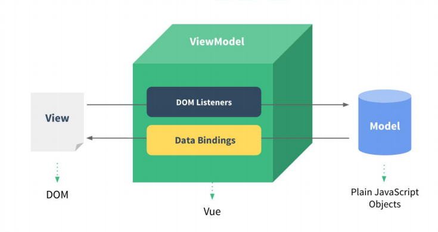

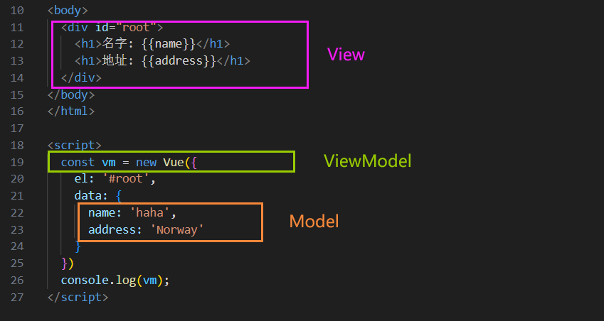


1.data中所有的属性，最后都出现在了vm身上。

2.vm身上所有的属性 及 Vue原型上所有属性，在Vue模板中都可以直接使用。

## 06 数据代理

从名字看出 这个是给对象添加/定义属性的

```javascript
  let person = {
    name: '张三',
    sex: '男',
  }

  Object.defineProperty(person, 'age', {
    value:18
  })

  console.log(person); // {name: '张三', sex: '男', age: 18}
```

在控制台可以看出，这个属性的颜色是淡一点的：

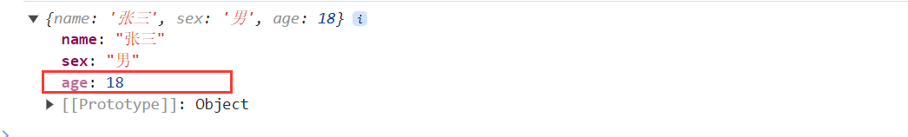

<font color="red">控制台中这个属性颜色淡：意味着 age这个属性不可枚举，也就是说age属性**不参与遍历**。</font>

当``` console.log(Object.keys(person));```时，只能拿到 name sex属性。

如果想让它参与遍历，借助 <font color="red">**enumerable**</font>。控制属性是否可以枚举，默认值是false

```javascript
  Object.defineProperty(person, 'age', {
    value:18,
    enumerable: true
  })
```

<font color="red">此时age属性是不可修改的，要借助 **writable**</font>。控制属性是否可以被修改，默认值是false

```javascript
  Object.defineProperty(person, 'age', {
    value:18,
    enumerable: true,
    writable: true
  })
```

<font color="red">此时age属性不可被删除，借助**configurable**</font>。控制属性是否可以被删除，默认值是false

```
  Object.defineProperty(person, 'age', {
    value:18,
    enumerable: true,
    writable: true,
    configurable: true
  })
```

- 需求  number变量存储年龄，let person对象中的age跟随 number的变化而变化。

  <font color="red">**get: function()** </font> 当有人读取person的age属性时，get函数就会被调用，且返回值就是age的值

```javascript
 let number = 18
 let person = {
    name: '张三',
    sex: '男',
  }

  Object.defineProperty(person, 'age', {
    // 当有人读取person的age属性时，get函数(getter)就会被调用，且返回值就是age的值
    get: function() {
       return number
    },
      
    //当有人修改person的age属性时，set函数(setter)就会被调用，且会收到修改的具体值,[注意是收到 但没有设置 通过number 修改]
    set: function(value) {
        number = value
    }
    
  })
```

### 概念

数据代理：通过一个对象代理对另一个对象中属性的操作（读/写）

- 案例 通过obj2操控obj

```javascript
let obj = {x:100}
let obj2 = {y:200}

Object.defineProperty(obj2,'x',{
  get(){
    return obj.x
  },
  set(value){
    obj.x = value
  }
})
```

### vue中的数据代理

```html
	<body>
		<!-- 准备好一个容器-->
		<div id="root">
			<h2>学校名称：{{name}}</h2>
			<h2>学校地址：{{address}}</h2>
		</div>
	</body>

	<script type="text/javascript">
		Vue.config.productionTip = false //阻止 vue 在启动时生成生产提示。
		
		const vm = new Vue({
			el:'#root',
			data:{
				name:'尚硅谷',
				address:'宏福科技园'
			}
		})
	</script>
```


在控制台中鼠标悬浮在 address name属性上，会有 [ invoke property getter]，发现这两个属性都有自己的setter getter

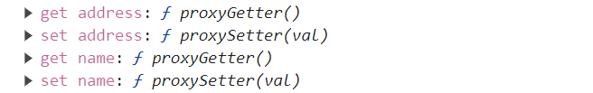

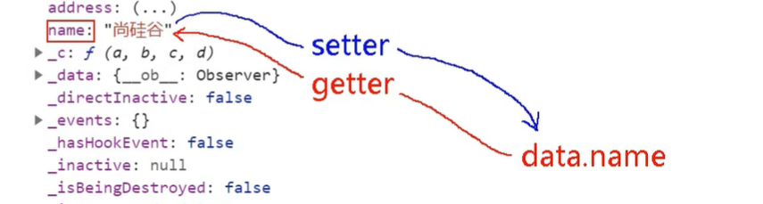

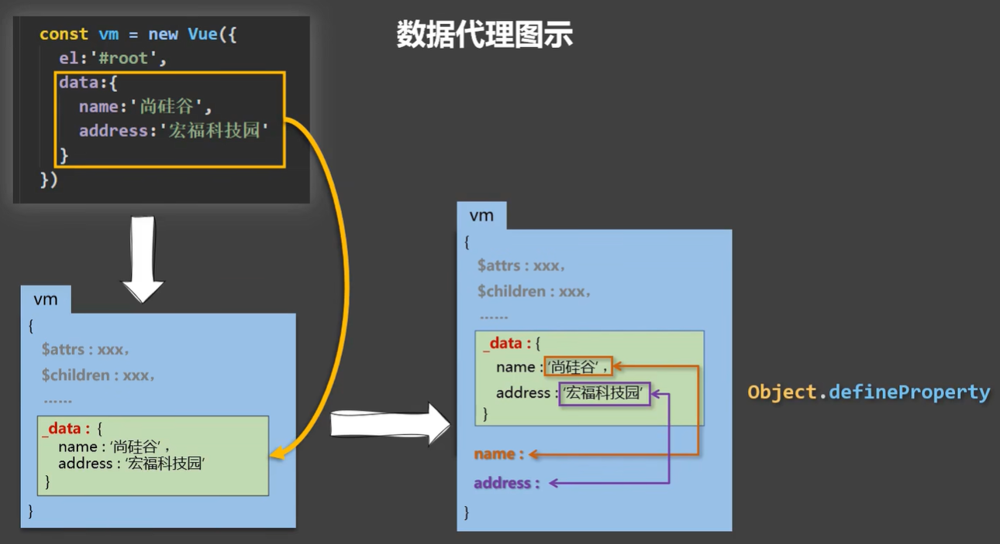


1. Vue中的数据代理：

​       通过vm对象来代理data对象中属性的操作（读/写）

​    2. Vue中数据代理的好处：  

​       更加方便的操作data中的数据

​    3. 基本原理：

​       通过Object.defineProperty()把data对象中所有属性添加到vm上。

​       为每一个添加到vm上的属性，都指定一个getter/setter。

​       在getter/setter内部去操作（读/写）data中对应的属性。

## 07 事件处理

### 事件的基本使用

事件的基本使用：

​       1.使用 v-on:xxx 或 @xxx 绑定事件，其中xxx是事件名；

​       2.事件的回调需要配置在methods对象中，最终会在vm上；

​       3.methods中配置的函数，不要用箭头函数！否则this就不是vm了；

​       4.methods中配置的函数，都是被Vue所管理的函数，this的指向是vm 或 组件实例对象；

​       5.@click="demo" 和 @click="demo($event)" 效果一致，但后者可以传参；可以传多个参数，但是methods中函数的参数顺序要和click绑定中一样

比如：@click="demo(a,b,$event) 。functiondemo(a,b,event) 

​    或者 @click="demo($event,a,b) 。functiondemo(event,a,b) 

- 示例

```html
<body>
  <div id="root">
    <h1>欢迎来到{{name}}学习</h1>
    <button v-on:click="showInfo1">按钮1</button>
    <button @click="showInfo2(66,$event)">按钮简写2</button>
  </div>
</body>


<script>
  const vm = new Vue({
    el: '#root',
    data: {
      name: '哈哈'
    },
    methods: {
      showInfo1(event){
        // 事件对象
        console.log(event.target);
        console.log(event.innerText);
        console.log(this === vm); // 此处的this 是vm
        alert("同学你好1111")
      },
      showInfo2(number,event){
        // showInfo2形参的顺序和 html中写的顺序一样
        console.log(number, a);

      },
    }
  })
</script>
```

### 事件修饰符

1. prevent：阻止默认事件（常用）；
2.  stop：阻止事件冒泡（常用）；
3. once：事件只触发一次（常用）；
4. capture：使用事件的捕获模式；
5. self：只有event.target是当前操作的元素时才触发事件；
6. passive：事件的默认行为立即执行，无需等待事件回调执行完毕


#### ①prevent阻止默认事件

这里给a绑定了一个点击事件，a的默认行为是跳转网址，之前阻止默认事件的方法是e.preventDefault()。Vue中可以  @click.prevent 进行阻止

```html
<body>
  <div id="root">
    <h1>欢迎来到{{name}}学习</h1>
    <a href="http://www.atguigu.com" @click.prevent="showInfo">点我提示信息</a>
  </div>
</body>
</html>

<script>
  const vm = new Vue({
    el: '#root',
    data: {
      name: 'hello'
    },
    methods: {
      showInfo(e) {
        // e.preventDefault() // 阻止默认调用行为
        alert('同学你好！')
      }
    }
  })
</script>
```

#### ②stop阻止事件冒泡

知识点：任意事件被触发时总会经历两个阶段：【捕获阶段】和【冒泡阶段】。捕获阶段是【从父到子】的传导过程，冒泡阶段是【从子向父】的传导过程。

**事件冒泡概念:**  当一个元素的事件被触发时，同样的事件将会在该元素的所有祖先元素中依次被触发。这一过程被称为事件冒泡。

如下图示例，button的父元素是div class="demo1"，两个元素都有点击事件，点击事件都绑定了 showInfo 方法，在点击button后，会冒泡到其父元素的身上。

之前的解决方法是  e.stopPropagation()。Vue中可以在click后面加 stop

```html
<body>
  <!-- 阻止事件冒泡（常用） -->
  <div id="root">
    <div class="demo1" @click="showInfo">
      <button @click.stop="showInfo">点我提示信息</button>
    </div>
  </div>

</body>


<script>
	Vue.config.productionTip = false //阻止 vue 在启动时生成生产提示。

  new Vue({
    el:'#root',
    data:{
      name:'尚硅谷'
    },
    methods:{
      showInfo(e){
        // e.stopPropagation()
        alert('哈哈')
      }
    }
  })
</script>
```

#### ③once事件只触发一次

设置 @click.once 之后，点击按钮，只有第一次有弹框

```html
<body>
  <!-- 阻止事件冒泡（常用） -->
  <div id="root">
    <div class="demo1">
      <button @click.once="showInfo">点我提示信息</button>
    </div>
  </div>

</body>


<script>
	Vue.config.productionTip = false //阻止 vue 在启动时生成生产提示。

  new Vue({
    el:'#root',
    data:{
      name:'尚硅谷'
    },
    methods:{
      showInfo(e){
        alert('哈哈')
      }
    }
  })
</script>
```

#### ④capture事件捕获

有这么一个结构：

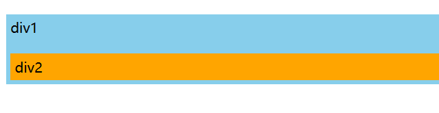

刚开始div1 div2都有 点击事件（点击div2打印2，点击div1打印1），在点击div2的时候，捕获情况默认不反馈，所以打印顺序为：2 1。（这是事件冒泡）

但是我们的需求是在捕获阶段就打印，所以用到capture。在外面的盒子的click上添加capture。此时打印顺序为 1 2

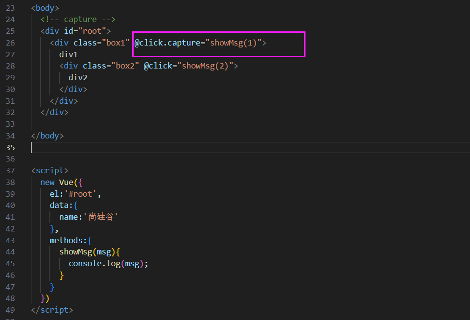

#### ⑤self 

self:  只有event.target是当前操作的元素时才触发事件。

从某种程度上 self也可以阻止冒泡

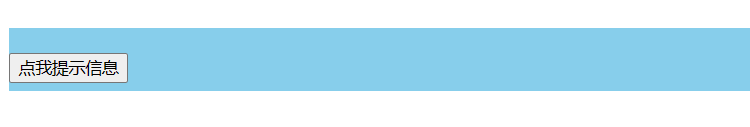

```html
<body>
  <!-- capture -->
  <div id="root">
    <!-- 只有event.target是当前操作的元素时才触发事件； -->
    <div class="demo1" @click="showInfo">
      <button @click="showInfo">点我提示信息</button>
    </div>
  </div>

</body>


<script>
  new Vue({
    el:'#root',
    data:{
      name:'尚硅谷'
    },
    methods:{
      showInfo(e){
        console.log(e.target)
      }
    }
  })
</script>
```

没处理之前，点击按钮，会打印点击的目标，且因为事件冒泡，再次打印。点击按钮时，不管是哪个元素调用了showInfo，他的 e.target都是 按钮。

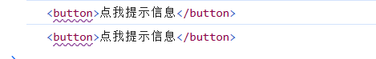

此时对div加上 self，再次**点击按钮**，就不会打印两次。

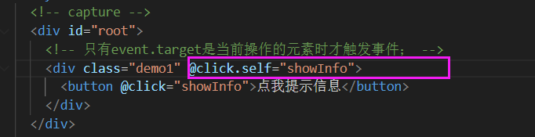

#### ⑥passive

**passive：事件的默认行为立即执行，无需等待事件回调执行完毕**

scroll滚动条的滚动（滚动条 鼠标上下），wheel滚动轮的滚动（鼠标的滚轮）。区别：滚动条在最底下的时候，鼠标滚轮滚动，wheel事件还可以触发，但是scroll不可以。

滚动的流程是：滚动了鼠标的滚轮之后，首先触发滚动事件demo，先处理demo函数，处理完之后，再去执行默认行为（滚动条往下走）。但如果 demo函数非常耗时间，可能等了很久都不会有。

但是加了passive之后事件的默认行为会立即执行。

#### 多个事件修饰符一起使用

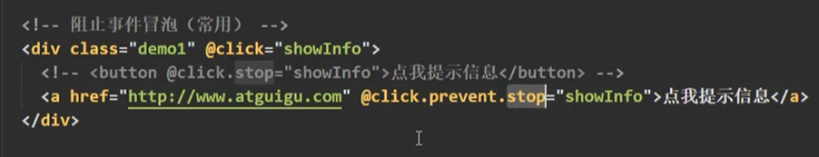

先阻止默认行为，再阻止冒泡

## 08 键盘事件

按下回车打印输入。

① 绑定键盘事件：键盘事件有 keydown（按下） keyup（按下且松开）。② 因为是按下回车 才打印，所以借助 e中的keycode

```html
<body>
  <div id="root">
    <h1>欢迎来到{{name}}学习</h1>
    <input type="text" placeholder="按下回车提示输入" @keyup="showInfo">
  </div>
</body>


<script>
  const vm = new Vue({
    el: '#root',
    data: {
      name: 'hello'
    },
    methods: {
      showInfo(e) {
        // 要在按下回车时才触发，借助e中的keycode
        // console.log(e.target.value);
        // console.log(e.keyCode);
        if(e.keyCode !== 13) return
        console.log(e.target.value);
      }
    }
  })
</script>
```

在vue中借助 enter

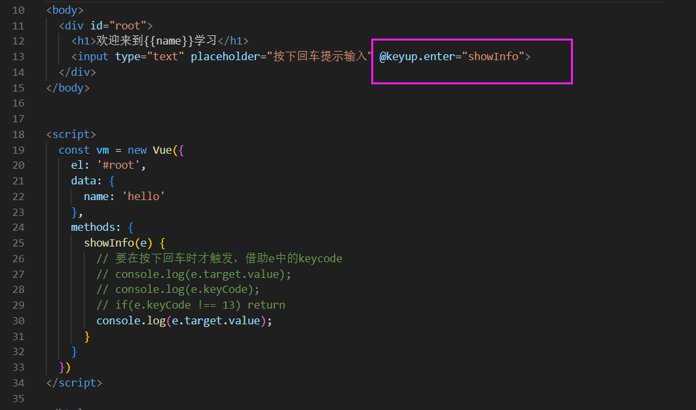

<font color="Red">把常用的归为别名。</font>

### 按键别名

按键绑定事件

- **Vue中常用的按键别名：**

​       回车 => enter

​       删除 => delete (捕获“删除”和“退格”键，backspace和delete都触发)

​       退出 => esc

​       空格 => space

​       换行 => tab (特殊，必须配合keydown去使用)

​       上 => up

​       下 => down

​       左 => left

​       右 => right

tab键本身就是把焦点从当前元素上切走，所以绑定keyup的时候，在抬起来的时候就切走了，就会导致keyup触发不了，所以他要配合keydown使用。

- **Vue未提供别名的按键，可以使用按键原始的key值去绑定，但注意要转为kebab-case（短横线命名）**

  补充：键盘中所有的按键都有自己的名字和按键编码。比如 回车键名字是 Enter，编码是13

  注意：通过<font color="red">e.key获得他的名字。</font>但是注意 像CapsLock这样的名字，要转化为 caps-lock才能执行

  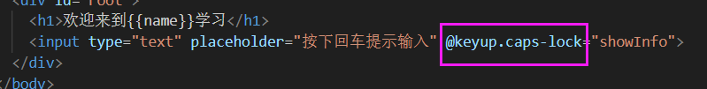

- **系统修饰键（用法特殊）：ctrl、alt、shift、meta**

​       (1).配合keyup使用：按下修饰键的同时，再按下其他键，随后释放其他键，事件才被触发。     

​              比如按下ctrl+y触发

​       (2).配合keydown使用：正常触发事件。

- **也可以使用keyCode去指定具体的按键（不推荐，MDN中说明了keyCode已经被废弃）**

- **Vue.config.keyCodes.自定义键名 = 键码，可以去定制按键别名**

#### 多个按键

输入CTRL+Y 才触发提示

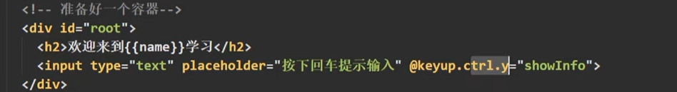

## 09 计算属性与监视

计算属性 Computed Properties

- **示例 实现如下效果**

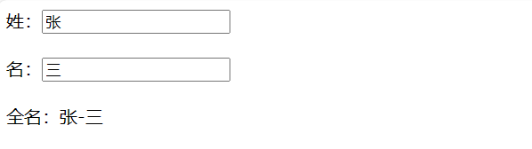

① 用插值语法实现：

```html
<body>
  <!-- 准备好一个容器-->
  <div id="root">
    姓：<input type="text" v-model="firstName"> <br/><br/>
    名：<input type="text" v-model="lastName"> <br/><br/>
    全名：<span>{{firstName}}-{{lastName}}</span>
  </div>
</body>

<script type="text/javascript">
  Vue.config.productionTip = false //阻止 vue 在启动时生成生产提示。

  new Vue({
    el:'#root',
    data:{
      firstName:'张',
      lastName:'三'
    }
  })
</script>
```

② 用 methods实现


fullName 没有写 箭头函数，它的this就是调用这个函数的对象，也就是 vm

<font color="red">data发生变化的时候，模板（HTML标签部分）都需要重新解析一遍。如果模板里用到data中的值，就需要重新解析一边；如果调用了函数，就需要重新调用一遍</font>

fullName调用了很多次，只要data中的值变化了，函数就调用一次

### 计算属性

<font color="red">**③ 计算属性**</font>

属性：对于Vue来说，他认为data里面的都是属性

计算属性：把原本data中的属性加工

```html
<body>
  <!-- 准备好一个容器-->
  <div id="root">
    姓：<input type="text" v-model="firstName"> <br/><br/>
    名：<input type="text" v-model="lastName"> <br/><br/>
    测试：<input type="text" v-model="x"> <br/><br/>
    全名：<span>{{fullName}}</span> <br/><br/>
    <!-- 全名：<span>{{fullName}}</span> <br/><br/>
    全名：<span>{{fullName}}</span> <br/><br/>
    全名：<span>{{fullName}}</span> -->
  </div>
</body>

<script type="text/javascript">

  const vm = new Vue({
    el:'#root',
    data:{
      firstName:'张',
      lastName:'三',
      x:'你好'
    },
    computed:{
      fullName:{
        //get有什么作用？当有人读取fullName时，get就会被调用，且返回值就作为fullName的值
        //get什么时候调用？1.初次读取fullName时。2.所依赖的数据发生变化时。
        get(){
          console.log('get被调用了')
          // console.log(this) //此处的this是vm
          return this.firstName + '-' + this.lastName
        },
        //set什么时候调用? 当fullName被修改时。
        set(value){
          console.log('set',value)
          const arr = value.split('-')
          this.firstName = arr[0]
          this.lastName = arr[1]
        }
      }
    }
  })
</script>
```

打印vm：

发现属性、计算属性都在 vm身上，怎么区分？ vm._data中存放了 data里的所有属性，但是没有计算属性。

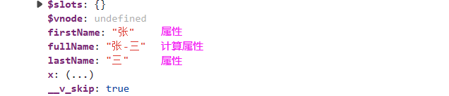

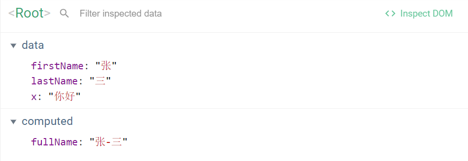

#### 使用细节

计算属性：

1.定义：要用的属性不存在，要通过**已有属性**计算得来。

2.原理：底层借助了Objcet.defineproperty方法提供的getter和setter。

3.get函数什么时候执行？

​       (1).初次读取时会执行一次。

​       (2).当依赖的数据发生改变时会被再次调用。

4.优势：与methods实现相比，内部有缓存机制（复用），效率更高，调试方便。

5.备注：

​      (1).计算属性最终会出现在vm上，直接读取使用即可。

​      (2).如果计算属性要被修改，那必须写set函数去响应修改，且set中要引起计算时依赖的数据发生改变。

#### 计算属性简写

一般来说 计算属性 不会被修改，所以只剩下get函数，所以引申出这种 简写模式

```javascript
const vm = new Vue({
el:'#root',
data:{
  firstName:'张',
  lastName:'三',
},
computed:{
  //完整写法
  /* fullName:{
    get(){
      console.log('get被调用了')
      return this.firstName + '-' + this.lastName
    },
    set(value){
      console.log('set',value)
      const arr = value.split('-')
      this.firstName = arr[0]
      this.lastName = arr[1]
    }
  } */
  //简写
  fullName(){
    console.log('get被调用了')
    return this.firstName + '-' + this.lastName
  }
  /*
  相当于 
  fullName: function(){  这个function就表示 get函数
    console.log('get被调用了')
    return this.firstName + '-' + this.lastName
  }
  */
}
})
```

### 监视属性 watch

侦听器 Watchers

- 示例

实现下面的案例

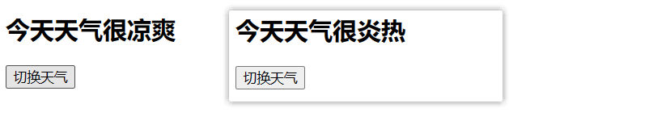

- ① methods实现

```html
<body>
  <div id="root">
    <h2>今天天气很{{info}}</h2>
    <button @click="changeWeather">切换天气</button>
    <!-- 也可以这么写，但是this要去掉
      <button @click="isHot = !isHot">切换天气</button> 
      这里会去 vm身上找
    -->
  </div>
</body>

<script type="text/javascript">
  Vue.config.productionTip = false //阻止 vue 在启动时生成生产提示。
  
  const vm = new Vue({
    el:'#root',
    data:{
      isHot:true,
    },
    computed:{
      info(){ // 计算属性的简写方式 
        return this.isHot ? '炎热' : '凉爽'
      }
    },
    methods: {
      changeWeather(){
        this.isHot = !this.isHot
      }
    },
  })
</script>
```

（BV1Zy4y1K7SH，P21）Vue在这种情况下会有一个小问题：当模板中没有用到data属性、计算属性时，点击按钮数据发生改变，但是开发工具上不会显示。

 

#### watch使用细节

<font color="red">**监视属性watch：**</font>

​     1.当被监视的属性变化时, 回调函数(handler immediate)自动调用, 进行相关操作

​     2.监视的属性必须存在，才能进行监视！data里的属性和计算属性都可以

​     3.监视的两种写法：

​       (1).new Vue时传入watch配置

​       (2).通过vm.$watch监视

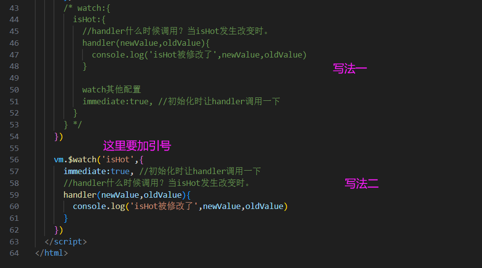

#### 深度监视

深度监视：

​      (1).Vue中的watch默认不监测对象内部值的改变（一层）。

​      (2).配置deep:true可以监测对象内部值改变（多层）。

备注：

​      (1).Vue自身可以监测对象内部值的改变，但Vue提供的watch默认不可以！

​      (2).使用watch时根据数据的具体结构，决定是否采用深度监视。

```javascript
const vm = new Vue({
  el:'#root',
  data:{
    numbers:{ // 有很多数字
      a:1,
      b:1,
      c:{
        d:{
          e:100
        }
      }
    }
    // 解释：data中的number属性地址为0x123，其地址指向一个对象，但Vue检测的是numbers中存储的内容
    // 也就是地址，地址不变 他不变
  },
  watch:{
    //监视多级结构中某个属性的变化
    /* 'numbers.a':{
      handler(){
        console.log('a被改变了')
      }
    } */
    //监视多级结构中所有属性的变化
    numbers:{
      deep:true,
      handler(){
        console.log('numbers改变了')
      }
    }
  }
})
```

#### 监视属性简写

简写1

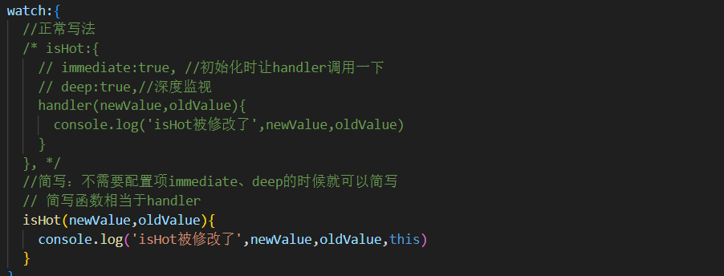

简写2

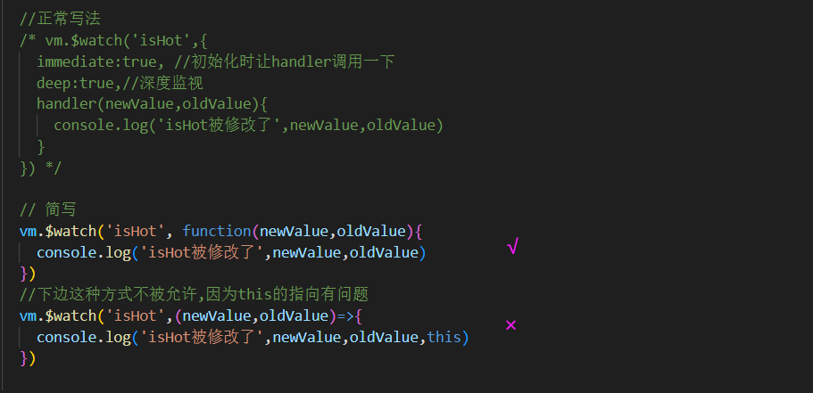

### computed和watch区别

**computed和watch之间的区别：**

1.computed能完成的功能，watch都可以完成。

2.watch能完成的功能，computed不一定能完成，例如：watch可以进行异步操作。


**两个重要的小原则：**

1.所被Vue管理的函数，最好写成普通函数，这样this的指向才是vm 或 组件实例对象。

2.所有不被Vue所管理的函数（定时器的回调函数、ajax的回调函数等、Promise的回调函数），最好写成箭头函数，这样this的指向才是vm 或 组件实例对象。

- 示例

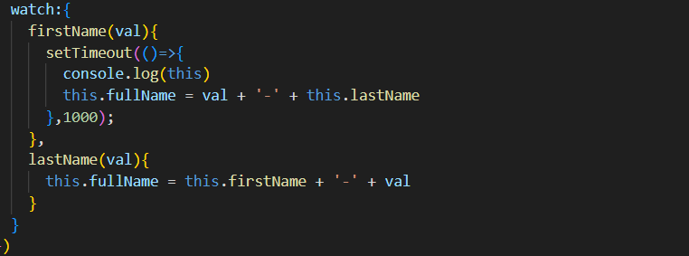

这里的setTimeOut里有回调函数，且用箭头函数写法，但请注意这里面的this。如果这里不写箭头函数问题就大了：因为定时器设置的时间到了之后，是系统window调用的回调函数，this就是window。但如果写成了箭头函数， 虽然也是window调用的回调函数，但是箭头函数就会失去了自己的this，就会往外找，外函数就是 firstName，是一个普通函数，是vue管理的函数

## 10 class 与 style 绑定

绑定样式：

​     **1. class样式**

​          写法:class="xxx" xxx可以是字符串、对象、数组。

​          字符串写法适用于：类名不确定，要动态获取。

​          对象写法适用于：要绑定多个样式，个数不确定，名字也不确定。

​          数组写法适用于：要绑定多个样式，个数确定，名字也确定，但不确定用不用。

​     **2. style样式**

​        :style="{fontSize: xxx}"其中xxx是动态值。 小驼峰写法

​        :style="[a,b]"其中a、b是样式对象。


- 示例

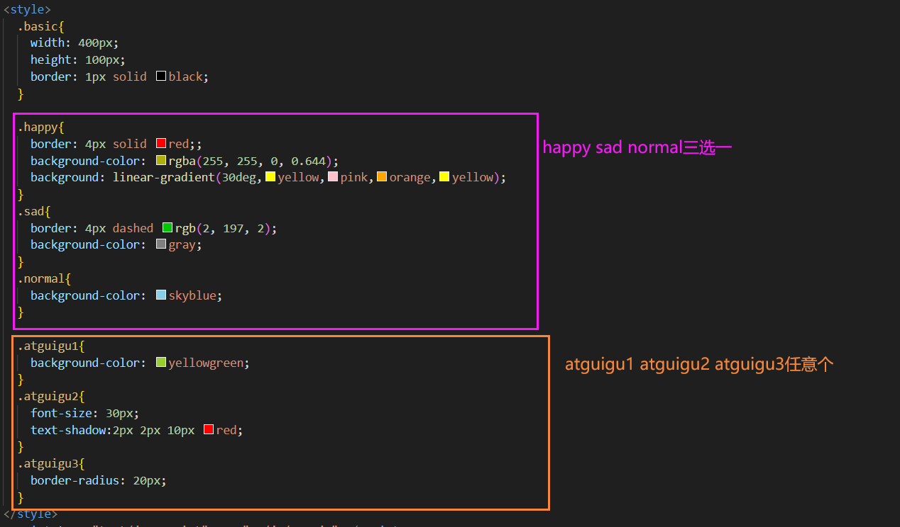

点击div之后 样式发生变化

之前的写法：document.querySelector('.demo').classList.add('normal')

```html
<body>
  <div id="root">
  <!-- 需求一: div为normal样式;点击div之后,随机写换class -->
    <!-- 绑定class样式--字符串写法，适用于：样式的类名不确定，需要动态指定 -->
    <div class="basic" :class="mood" @click="changeMood">{{name}}</div> <br/><br/>

  <!-- 需求二:除了基本样式,atguigu1 atguigu2 atguigu3不确定有几个 -->
    <!-- 绑定class样式--数组写法，适用于：要绑定的样式个数不确定、名字也不确定 
        可以通过对数组 vm.classArr 的增删改 改变绑定的样式-->
    <div class="basic" :class="classArr">{{name}}</div> <br/><br/>
  
  <!-- 需求三: atguigu1 atguigu2二选一 -->
    <!-- 绑定class样式--对象写法，适用于：要绑定的样式个数确定、名字也确定，但要动态决定用不用 -->
    <div class="basic" :class="classObj">{{name}}</div> <br/><br/>

    <!-- 绑定style样式--对象写法 -->
    <div class="basic" :style="styleObj">{{name}}</div> <br/><br/>
    <!-- 绑定style样式--数组写法 -->
    <div class="basic" :style="styleArr">{{name}}</div>
  </div>
</body>

<script type="text/javascript">
  Vue.config.productionTip = false
  
  const vm = new Vue({
    el:'#root',
    data:{
      name:'尚硅谷',
      mood:'normal',
      classArr:['atguigu1','atguigu2','atguigu3'],
      classObj:{
        atguigu1:false,
        atguigu2:false,
      },
      styleObj:{
        fontSize: '40px',
        color:'red',
      },
      styleObj2:{
        backgroundColor:'orange'
      },
      styleArr:[
        {
          fontSize: '40px',
          color:'blue',
        },
        {
          backgroundColor:'gray'
        }
      ]
    },
    methods: {
      changeMood(){
        const arr = ['happy','sad','normal']
        const index = Math.floor(Math.random()*3)
        this.mood = arr[index]
      }
    },
  })
</script>
```

## 11 条件渲染

Conditional Rendering

### 条件渲染指令

1. v-if 与 v-else
2. v-show


<font color="red">**1.v-if**</font>

   **写法：**

​     (1).v-if="表达式" 

​     (2).v-else-if="表达式"

​     (3).v-else="表达式"

   适用于：切换频率较低的场景。

   **特点：**不展示的DOM元素直接被移除。

   **注意：**v-if可以和:v-else-if、v-else一起使用，但要求结构不能被“打断”。

​              v-if与template的配合使用，注意template只能搭配 v-if 不能搭配 v-show

<font color="red">**2.v-show**</font>

   **写法：**v-show="表达式" 底层逻辑是调整样式display

   适用于：切换频率较高的场景。

   **特点：**不展示的DOM元素未被移除，仅仅是使用样式隐藏掉

 

3.备注：使用v-if的时，元素可能无法获取到，而使用v-show一定可以获取到。


- 示例 v-show和v-if

```html
<!-- 使用v-show做条件渲染 -->
<h2 v-show="false">欢迎来到{{name}}</h2>
<h2 v-show="1 === 1">欢迎来到{{name}}</h2> 

<!-- 使用v-if做条件渲染 -->
<h2 v-if="false">欢迎来到{{name}}</h2>
<h2 v-if="1 === 1">欢迎来到{{name}}</h2> 
```

- v-if与template的配合使用

如果这里写了 ```<div>```就相当于破坏了结构，因为页面中三个h2不需要div包起来，使用template不会破坏结构。**注意template只能搭配 v-if 不能搭配 v-show**

```html
<template v-if="n === 1">
  <h2>你好</h2>
  <h2>尚硅谷</h2>
  <h2>北京</h2>
</template>
```


### 比较 v-if 与 v-show

1. 如果需要频繁切换 v-show 较好
2. 当条件不成立时, v-if 的所有子节点不会解析(项目中使用)

## 12 列表渲染

### **列表显示指令**

遍历数组: v-for / index

遍历对象: v-for / key

- 示例：遍历数组

注意①想让谁重复 v-for就写在谁身上 

注意②(p,index) **of** persons或者 (p,index) **in** persons 都行

注意③index必须要有 

注意④  v-for="(value,index)"顺序不能变化

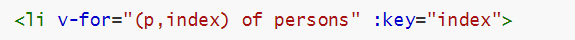

```html
<div id="root">
  <!-- 遍历数组 -->
  <h2>人员列表（遍历数组）</h2>
  <ul>
    <li v-for="(p,index) of persons" :key="index">
      {{p.name}}-{{p.age}}   
    </li>
      <!-- 插值语法内 变量的值 来自于 data属性 或者 还没被计算出来的计算属性 或者 v-指令=""中的 -->
  </ul>
</div>

<script type="text/javascript">
  new Vue({
    el:'#root',
    data:{
      persons:[
        // 每一个人都必须有一个唯一的标识
        {id:'001',name:'张三',age:18},
        {id:'002',name:'李四',age:19},
        {id:'003',name:'王五',age:20}
      ]
    }
  })
</script>
```

效果为：

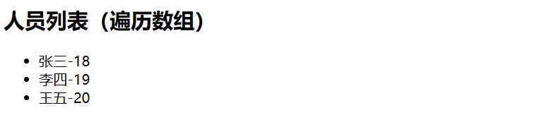

- 示例：遍历对象、字符串、指定次数

遍历对象的时候 v-for="(value,key) in car" key是键

遍历字符串 每一个 是它的字符

```html
<!-- 遍历对象 -->
<h2>汽车信息（遍历对象）</h2>
<ul>
  <li v-for="(value,k) of car" :key="k">
    {{k}}-{{value}}
  </li>
</ul>

<!-- 遍历字符串 -->
<h2>测试遍历字符串（用得少）</h2>
<ul>
  <li v-for="(char,index) of str" :key="index">
    {{char}}-{{index}}
  </li>
</ul>

<!-- 遍历指定次数 -->
<h2>测试遍历指定次数（用得少）</h2>
<ul>
  <li v-for="(number,index) of 5" :key="index">
    {{index}}-{{number}}
  </li>
</ul>
</div>

<script type="text/javascript">
  Vue.config.productionTip = false
  
  new Vue({
    el:'#root',
    data:{
      car:{
        name:'奥迪A8',
        price:'70万',
        color:'黑色'
      },
      str:'hello'
    }
  })
</script>
```

