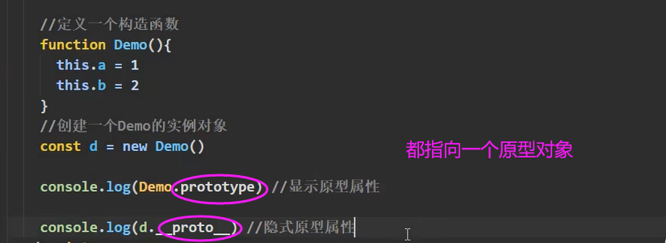
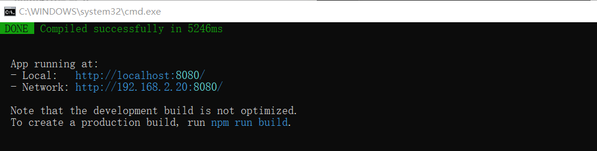

# Vue 02

> B站 Vue全家桶（BV1Zy4y1K7SH） 学习笔记

## 01 组件

### 引入

- 传统方式的局限性


- 组件方式编写


**组件的定义—实现应用中局部功能代码和资源的集合**


### 概念

**模块**

1. 理解: 向外提供特定功能的 js 程序, 一般就是一个 js 文件
2. 为什么: js 文件很多很复杂
3. 作用: 复用 js, 简化 js 的编写, 提高 js 运行效率

**组件**

1. 理解: 用来实现局部(特定)功能效果的代码集合(html/css/js/image…..)
2. 为什么: 一个界面的功能很复杂3. 作用: 复用编码, 简化项目编码, 提高运行效率

**模块化**

当应用中的 js 都以模块来编写的, 那这个应用就是一个模块化的应用。

**组件化**

当应用中的功能都是多组件的方式来编写的, 那这个应用就是一个组件化的应用,。

### 组件的两种编写形式

非单文件组件：一个文件中包含有n个组件。
单文件组件∶一个文件中只包含有1个组件。

#### ① 非单文件组件

- 示例

显示信息 学校（名字，地址），学生（姓名，年龄）。name会重复，所以创建学校组件和学生组件。

**第一步 创建组件**


template ：需要一个根元素

**第二部 注册组件(以局部注册为例)**

 

**第三步使用组件**

 


##### 基本使用

Vue中使用组件的三大步骤：

一、定义组件(创建组件)

二、注册组件

三、使用组件(写组件标签)


**一、如何定义一个组件？**

使用 Vue.extend(options) 创建，其中 options 和 new Vue(options) 时传入的那个options几乎一样，但也有点区别；

 区别如下：

- 1.el不要写，为什么？ ——— 最终所有的组件都要经过一个vm的管理，由vm中的el决定服务哪个容器。   
- 2.data必须写成函数，为什么？ ———— 避免组件被复用时，数据存在引用关系。

 备注：使用template可以配置组件结构,但必须有一个根节点。

**二、如何注册组件？**

 1.局部注册：靠new Vue的时候传入components选项

 2.全局注册：靠Vue.component('组件名',组件)

**三、编写组件标签：**

``` <school></school>```

##### 使用细节

**1.关于组件名:**

- 一个单词组成：

​       第一种写法(首字母小写)：school  使用时 ``` <school></school>```

​       第二种写法(首字母大写)：School  使用时 ```<School></School>```

- 多个单词组成：

​       第一种写法(kebab-case命名)：my-school

​                  局部注册 components: 'my-school': s  。使用``` <my-school></my-school>```

​       第二种写法(CamelCase命名)：MySchool  **(需要Vue脚手架支持)**

​                  局部注册 components: 'MySchool': s  。使用``` <MySchool></MySchool>```

​    **注意：**

​      (1).组件名尽可能回避HTML中已有的元素名称，例如：h2、H2都不行。

​      (2).可以使用name配置项指定组件在开发者工具中呈现的名字。


**2.关于组件标签**

​    第一种写法：```<school></school>```

​    第二种写法：```<school/>```

​    备注：不用使用脚手架时，```<school/>``` 会导致后续组件不能渲染。

**3.组件定义的简写方式**

​    const school = Vue.extend(options) 可简写为：const school = options

```javascript
//定义组件
const s = Vue.extend({
  name:'atguigu',
  template:`
    <div>
      <h2>学校名称：{{name}}</h2>	
      <h2>学校地址：{{address}}</h2>	
    </div>
  `,
  data(){
    return {
      name:'尚硅谷',
      address:'北京'
    }
  }
})

// 简写为：
//定义组件
const s = {
  name:'atguigu',
  template:`
    <div>
      <h2>学校名称：{{name}}</h2>	
      <h2>学校地址：{{address}}</h2>	
    </div>
  `,
  data(){
    return {
      name:'尚硅谷',
      address:'北京'
    }
  }
}
```

##### 组件嵌套

student 组件 是 school 组件 的子组件

- 实例

```html
<body>
  <div id="root">
    <h1>{{msg}}</h1>
    <school></school>
  </div>
</body>

<script>
  //定义student组件
  const student = Vue.extend({
    name:'student',
    template:`
      <div>
        <h2>学生姓名：{{name}}</h2>	
        <h2>学生年龄：{{age}}</h2>	
      </div>
    `,
    data(){
      return {
        name:'尚硅谷',
        age:18
      }
    }
  })

  const school = Vue.extend({
    name: 'school',
    template: `
      <div>
        <h2>{{name}}</h2>
        <h2>{{address}}</h2>
        <student></student>
      </div>
    `,
    data: function() {
      return {
        name: 'xxx大学',
        address: 'xxx省xxx市'
      }
    },
    components: {
      student
    }
  })


  new Vue({
    el: '#root',
    data: {
      msg: '开学了'
    },
    components: {
      school
    }
  })
</script>
```


<font color="red">开发中常用组件 app，用于管理页面中所有的组件。</font>

 


 

  

##### 组件本质 VueComponent

 console.log('@',school)


**打印组件school 发现它是一个函数，实际上它是一个构造函数。**

```javascript
//定义school组件
const school = Vue.extend({
  name:'school',
  template:`
    <div>
      <h2>学校名称：{{name}}</h2>	
      <h2>学校地址：{{address}}</h2>	
      <button @click="showName">点我提示学校名</button>
    </div>
  `,
  data(){
    return {
      name:'尚硅谷',
      address:'北京'
    }
  },
  methods: {
    showName(){
      console.log('showName',this)
    }
  },
})
```

**在源码中搜索VueComponent可以发现 **


**<font color="red">关于VueComponent</font>**

<font color="red">(1) school组件本质是一个名为**VueComponent的构造函数**，且不是程序员定义的，是Vue.extend生成的。</font>

<font color="red">(2) 我们只需要写```<school/>```或```<school></school>```，Vue解析时会帮我们创建school组件的**实例对象**，即Vue帮我们执行的：new VueComponent(options)。</font>

<font color="red">(3) 特别注意：每次调用Vue.extend，返回的都是一个**全新**的VueComponent！！！！</font>

通过源码得知 Vue.extend是函数，在 Vue.extend中会返回一个新的VueC omponent

<font color="red">**(4) 关于this指向：**</font>

​        A. 组件配置中：data函数、methods中的函数、watch中的函数、computed中的函数 它们的this均是【VueComponent实例对象】。

​        B. new Vue(options)配置中：data函数、methods中的函数、watch中的函数、computed中的函数 它们的this均是【Vue实例对象】。

<font color="red">(5) VueComponent的实例对象，以后简称vc（也可称之为：组件实例对象）。</font>

​       Vue的实例对象，以后简称vm。

##### 重要的内置关系

原型回顾：



```console.log(Demo.prototype  ===  d.___proto__)``` 结果为TRUE


 

```console.log(d)```  :

输出d，d是构造函数 Demo 的实例对象，它自身是没有 x 属性的。所以通过隐式原型属性查找。


<font color="red">**一个重要的内置关系：**```VueComponent.prototype.__proto__ === Vue.prototype```</font>

```javascript

//定义school组件
const school = Vue.extend({
  name:'school',
  template:`
    <div>
      <h2>学校名称：{{name}}</h2>	
      <h2>学校地址：{{address}}</h2>	
      <button @click="showX">点我输出x</button>
    </div>
  `,
  data(){
    return {
      name:'尚硅谷',
      address:'北京'
    }
  },
  methods: {
    showX(){
      console.log(this.x)
    }
  },
})

//创建一个vm
const vm = new Vue({
  el:'#root',
  data:{
    msg:'你好'
  },
  components:{school}
})
```


<font color="red">1.一个重要的内置关系：VueComponent.prototype.__proto__ === Vue.prototype</font>

<font color="red">2.为什么要有这个关系：让组件实例对象（vc）可以访问到 Vue原型上的属性、方法。</font>

解释分析：

（1）```<script type="text/javascript" src="../js/vue.js"></script>```引入 vue.js后，全局多了一个Vue构造函数。

【JavaScript 规定，每一个构造函数都有一个 prototype 属性，指向另一个对象，所以我们也称为原型对象】 所以 构造函数 Vue中有一个 prototype 属性，指向 Vue 原型对象。

通过构造函数 构造出的实例对象，都可以访问 原型对象 上的方法与属性。

（2）const vm = new Vue({}) 

 实例对象 vm 中 有隐式原型属性 ```__proto__ ```,也指向原型对象。

（3）Vue的原型对象，也是对象，所以它里面也有一个 隐式原型属性 ```__proto__ ```，指向Object的原型对象。

**实例的隐式原型属性（proto）永远指向自己缔造者 的原型对象。**

【对象都会有一个属性 ```__proto__``` 】


（4）有一个构造函数 VueComponent ，构造函数身上有一个 prototype 属性，指向 VueComponent 的原型对象。


#### ② 单文件组件

单文件组件的 格式是 ：XXX.vue

注意 XXX.vue 不能直接交给浏览器运行，所以得先进行处理和加工。有两个渠道：① webpack ② vue-cli （官方帮忙搭建的 webpack ）

- 示例

（1）起名注意事项（加粗的为推荐）

单个单词：school.vue  或者 **School.vue** 

多个单词：my-school.vue  或者 **MySchool.vue** 

（2）组件是资源（HTML CSS JS）的集合

为了迎合组间比较常见的属性， vue文件设计出了三个标签


（3）代码格式

注意： template不参与结构编译

export：

 

**最终写为：**

 

（4）必须要有App.vue 汇总所有的组件

 

 （5） 浏览器不认识 ES6语法，必须要使用脚手架 

## 02 Vue CLI

command line interface

### 介绍 & 文档

1. Vue 脚手架是 Vue 官方提供的标准化开发工具（开发平台）。
2. 最新的版本是 4.x。
3. 文档: https://cli.vuejs.org/zh/。

### 安装


下载完之后，关闭CMD，再打开，输入vue


### 使用步骤

（1）配置 npm 淘宝镜像：npm config set registry https://registry.npm.taobao.org


（2）vue create vue_test

 

babel： ES6转ES5

eslint：语法检查


输入完 npm run serve之后：



他开启了内置的服务器：端口在8080

local是本机访问

network是可以给同局域网的其他人使用（在连接同一个wifi的情况下，用手机可以访问这个）

### 脚手架结构

.gitignore：git的忽略文件

babel.config.js：babel的控制文件

package-lock.json和package.json：只要打开的工程是符合npm规范，那么就会有package.json报的说明书；package-lock.json是包版本控制文件

-----

- main.js

执行了 npm run serve之后，直接运行 main.js


在 main.js中发现 import App ，所以去App.vue 里；

在App.vue中又看到了 import School 和 Student，所以引入。

在main.js发现他挂载到 app上。


- 报错：VUE中的 文件名 要用多个单词

### render

一般来说 引入  都是要具体一个路径（XX文件下的） ，比如 import App from './App.vue'

但是第三方库 就不用， 比如  import Vue from 'vue'

注意 通过跳转，我们可以知道 这个 import Vue from 'vue' 引入的是不完全的 vue


找到 vue 底下的 package.json。module的意思是，在使用ES6引入的时候，引入的其实是 vue.runtime.esm.js


这是因为 vue包含 核心+模板解析器：只需要有精简部分


render的用处就是 解析模板。


 **关于不同版本的Vue：**

  1.vue.js与vue.runtime.xxx.js的区别： 

​    (1).vue.js是完整版的Vue，包含：核心功能+模板解析器。

​    (2).vue.runtime.xxx.js是运行版的Vue，只包含：核心功能；没有模板解析器。

  2.因为vue.runtime.xxx.js没有模板解析器，所以不能使用template配置项，需要使用

   render函数接收到的createElement函数去指定具体内容。

### 默认配置

脚手架依托WEBPACK，webpack.config.js(配置文件，配置入口，出口文件的路径)。Vue把重要的配置文件隐藏了。


- Vue 脚手架隐藏了所有 webpack 相关的配置，若想查看具体的 webpakc 配置，请执行：```vue inspect > output.js```


注意 在这个文件夹中修改是没有用的，只是输出给你看一下。

- 哪些东西不能随便改（以下五个不能随便改）

public 文件夹、index.html、favicon.ico

src文件夹

main.js

- 怎么改默认配置？

vue.config.js

> https://cli.vuejs.org/zh/config/#pages


 

<font color="red">**脚手架文件结构**</font>


<font color="red">**关于不同版本的Vue**</font>

- vue.js与vue.runtime.xxx.js的区别： 

​    (1).vue.js是完整版的Vue，包含：核心功能+模板解析器。

​    (2).vue.runtime.xxx.js是运行版的Vue，只包含：核心功能；没有模板解析器。

- 因为 vue.runtime.xxx.js 没有模板解析器，所以不能使用template配置项，需要使用

   render函数接收到的createElement函数去指定具体内容。

<font color="red">**vue.config.js配置文件**</font>

使用 vue inspect > output.js可以查看到 Vue 脚手架的默认配置.
使用 vue.config.js 可以对脚手架进行个性化定制，详情见: https://cli.vuejs.org/zh