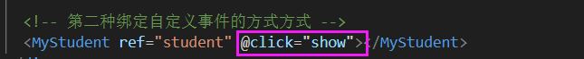

# Vue 03

## 01 浏览器本地存储

localStorage 和 SessionStorage 统称为 webStorage。

1. 存储内容大小一般支持5MB左右(不同浏览器可能还不一样)

2. 浏览器端通过 Window.sessionStorage 和 Window.localStorage 属性来实现本地存储机制。

3. 相关API:

   setItem、getItem、removeItem、clear

4. 备注

① SessionStorage 存储的内容会随着浏览器窗口关闭而消失。

② LocalStorage 存储的内容，需要手动清除才会消失。

③ xxxxxStorage.getItem(xxx) 如果xxx对应的value获取不到，那么getltem的返回值是null。

④ JSON.parse(null) 的结果依然是 null。

### localStorage


- 示例

```html
<body>
  <h1>localStorage</h1>
  <button class="btn">点我保存一个数据</button>
  <button class="btn2">点我删除一个数据</button>
  <button class="btn3">点我清空数据</button>
</body>
<script>
  let p = {name:'张三',age:16}

  document.querySelector('.btn').addEventListener('click',()=>{
    //存字符串
    window.localStorage.setItem('msg', 'hello!')
    // 存对象
    localStorage.setItem('person',JSON.stringify(p))

    // 读
    // localStorage.getItem('msg')
    console.log(localStorage.getItem('msg'));
    console.log(localStorage.getItem('person'));
    console.log(JSON.parse(localStorage.getItem('person')));
    // 当读取的key没有时，是null
  })

  document.querySelector('.btn2').addEventListener('click',()=>{
    //删除
    localStorage.removeItem('msg')
  })

  document.querySelector('.btn3').addEventListener('click',()=>{
    localStorage.clear()
  })
</script>
```


### SessionStorage

API 和 localStorage 一样。getItem、SetItem、removeItem、clear（JSON.stringify、JSON.parse）

区别在关闭浏览器时，SessionStorage中存储的就失去

### 案例 todolist的完善

把数据存进localstorage中。本来是想 添加todo的时候，存入localstorage；删除todo的时候，在localstorage中删除。

但是不用这么麻烦，直接watch监视todos就可以了。

注意：监视的时候默认开启的不是深度监视

## 02 组件自定义事件

JS 中的内置事件，如 keyup、click等，是给HTML元素使用的

自定义事件是给组件使用的。

### 基本使用

- 示例

 


 


- 另一种写法（这种写法更灵活）


子组件给父组件传递数据 总结：

① 通过父组件给子组件传递函数类型的props实现

② 通过父组件给子组件绑定一个自定义事件


注意

① 自定义事件也可以使用事件修饰符，比如 once

② 自定义事件可以传递参数。如果传递的参数很多，可以封装为对象，或者接收的时候，用拓展运算符

### 解绑自定义事件

原则和绑定自定义事件是一样的：在App.vue中给```<Student/>```组件绑定自定义事件，就去 ```<Student/>```组件中触发事件、解绑事件


- 示例

写法一：只适用于解绑单个事件


写法二：解绑多个事件要写在数组里

 

解绑所有的自定义事件：

 


补充之前的知识点：生命周期里面，销毁了当前组件实例，其实例里面的自定义事件（子组件和自组件的自定义事件）全部都不奏效了。但是原生的 JS 不受影响。

### 注意事项

App

   school

   student

#### ①

- student组件把名字发送给App后呈现在页面上，

因为绑定自定义事件有两种凡是，所以这个也有两种方式


 


<font color="red">但是上面的代码可能会出现问题。</font>

 

这么写是错的.

vue规定，谁触发 atguigu 事件，那么回调函数中的 this 就是谁。本例是 student 组件触发的事件，所以this是student组件实例。

修改为箭头函数就可以了，因为箭头函数没有自己的this，就往外找，找到了 mounted函数的作用域

 

#### ②

可以给组件绑定 JS 内置事件吗？

  

他会默认把click当成自定义事件。

默认是不触发的，但是可以在 student 组件中触发这个事件 this.$emit('click')。

解决方法：使用**native修饰符**

 


### 总结

组件的自定义事件

1、一种组件间通信的方式，适用于：子组件===>父组件

2、使用场景：A是父组件，B是子组件，B想给A传数据，那么就要在A中给B绑定自定义事件（事件的回调在A中)。

3、绑定自定义事件：

 

注意：若想让自定义事件只能触发一次，可以使用once修饰符，或 $once方法。

4、触发自定义事件：this.$emit('atguigu',数据)

5、解绑自定义事件：this.$off('atguigu')

6、组件上也可以绑定原生DOM事件，需要使用native修饰符

7、注意：通过 ```this.$refs.xxx.$on('atguigu',回调)``` 绑定自定义事件时，回调要么配置在methods中，要么用箭头函数，否则 this 的指向会出问题。


### 案例 todolist的完善

把所有子给父的传递 都变成自定义事件。

MyHeader添加一个todo之后，把新数据传递给 App

MyFooter中统计已完成/总计，把新数据传递给App

## 03 全局事件总线

任意组件通信。

在A中 给 X组件绑定一个自定义事件，会议回调函数demo是留在A中的。

D想给A传递数据，那就通过X demo

 

X得保证①所有组件都能看见它②有$on $off $emit


**《一个重要的内置关系》 Vue的原型上**

注意 Vue.extned创建的是 VueComponent构造函数，使用组件的时候：<组件>，才是实例

谁要接收数据，就由谁绑定事件且余留回调函数。谁要发送数据，就由谁触发事件。


<font color="red">**全局事件总线 GlobalEventBus** </font>

1、一种组件间通信的方式，适用于任意组件间通信

2、安装全局事件总线：

 

3、使用事件组件：

 

4、最好在 beforeDestroy 钩子中，用$off 去解绑当前组件所用到的 事件

### 案例 todolist的完善

谁要接收数据，就由谁绑定事件且余留回调函数（在mounted的时候绑定最合适）。谁要发送数据，就由谁触发事件。

## 04 消息的订阅与发布

用于任意组件通信。

**需要数据的组件：订阅消息。提供数据的组件：发送消息。**

原生的 JS 里面不能实现订阅与发布，所以借助第三方库：pubsub-js。消息的订阅与发布是一种理念，要借助第三方库实现。

- 以pubsub-js为例

```npm i pubsub-js```

```import pubsub from 'pubsub-js'```

pubsub 是一个对象，里面有方法 subscribe、 unsubscribe、 publish


- 这里订阅消息时 的回调函数function 内没有this指针，可以写成箭头函数，这样this就指向组件实例了。
- **回调函数的参数，第一个是固定的 消息名字；第二个才是参数** 。可以在一个参数上用下划线占一个位置。


<font color="red">**总结：消息订阅与发布（pubsub）**</font>

1、一种组件间通信的方式、适用于任意组件间通信

2、使用步骤：

① 安装pubsub ```npm i pubsub-js```

② 引入```import pubsub from 'pubsub-js'```。一般第三方库要比组件库的引入前。

③ 接收数据：A组件想接收数据，则在A中订阅消息，消息的回调留在A中

 

④ 提供数据：```pubsub.publish('xxx',数据)```

⑤ 最好在 beforeDestroy 钩子中，用 PubSub.unsubscribe(pid) 去 取消订阅

### 案例 todolist的完善

- 订阅功能

需要数据的地方订阅消息；提供数据的地方发送消息

vue开发工具不监测第三方库的事件，vue可以监听全局事件总线、自定义事件

- 编辑功能

重点：直接在对象上添加一个属性，这个数据不是响应式的，vue无法监测

要使用 this.$set(todo,'isEdit',true)