# Vue 04

Vue 中的 ajax

# 01 Vue中的Ajax

## 服务器准备

老师写好了一个服务器 V:\Web\Vue_\myCode_Vue2\test_proxy_server

 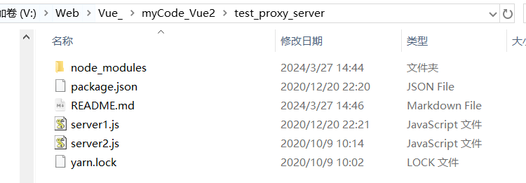

在 cmd 中 ```node server1 ```  运行

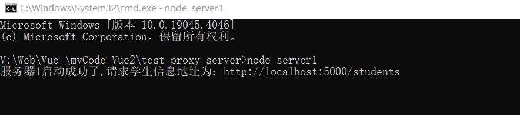

**服务器1** 开在电脑的5000端口。

是普通的GET请求，返回一些学生的信息，通过浏览器可以看到：

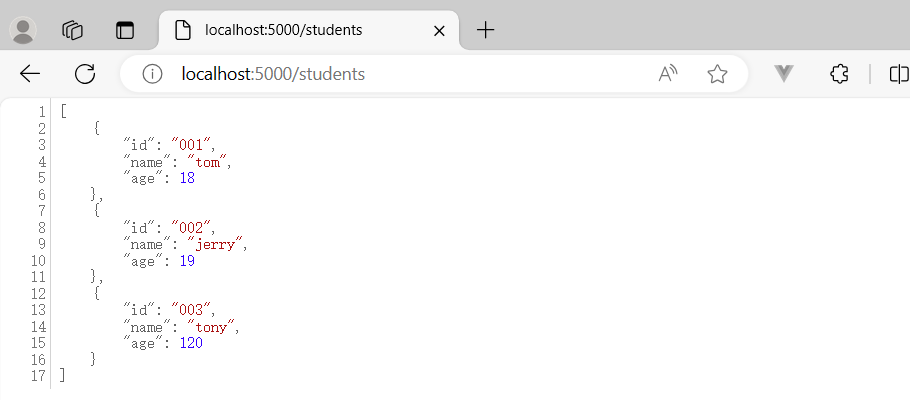

**服务器2** 开在电脑的5001端口。

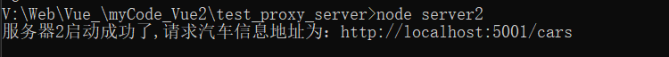


<font color="red">**常用的发送一个AJAX请求的方式有：**</font>

1、xhr：new XMLHttpRequest()    xhr.open()  xhr.send() 不常用

2、jQuery  $.get   $.post  里面封装了很多DOM操作 但vue react不操作DOM 

3、**axios** 尤雨溪推荐

4、fetch

jQuery  axios是对 XHR的封装，fetch和XHR平级，fetch是promise风格的

## axios使用

记得先打开自己写的服务器 http://localhost:5000/students

① 下载 npm i axios

② 引入 import 'axios' from axios

③ 使用 axios 

```html
<template>
  <div>
    <button @click="getStudent">获取学生信息</button>
  </div>
</template>

<script>
import axios from 'axios'
export default {
  name: 'App',
  methods: {
    getStudent() {
      axios.get('http://localhost:5000/students').then(
        response=>{
          console.log('请求成功', response.data);
        },
        error => {
          console.log('请求失败', error.message);
        }
      )
    }
  }
}
</script>
```

### 跨域问题解决

<font color="Red">**发现报错**</font>

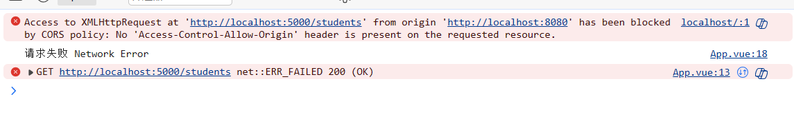

捕获到关键信息  CORS 、'Access-Control-Allow-Origin' 得知跨域了。

**跨域 **的意思是：违背了同源策略（同源策略规定了三个一致：协议名、主机名、端口号）。比如我们在电脑上运行这个代码的时候处于8080端口号，http://localhost:8080/ 协议名是http 主机名是 localhost，端口号是8080。

请求发出去了，服务器接收到了，也返回了数据，但是浏览器发现跨域，就没有把数据给我们。

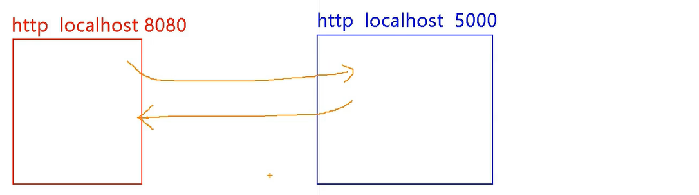

**怎么解决跨域？**

1、cors解决：不用前端人员做什么事情，写服务器的程序员返回响应的时候，加几个特殊的响应头，浏览器看到之后知道数据必须给你。

2、jsonp解决：借助了script标签的src属性在引入外部资源的时候不受同源策略的限制这个特点，实现的。真正开发用的很少。而且也只能解决 GET 请求。

3、配置一个<font color="red">代理服务器</font>：**开发中用的很多**。

代理服务器本身是一个服务器，代理服务器跟我们（前端人员）所处的端口号是一样的。代理服务器接受到我们的请求之后，向服务器请求，并把数据给我们。

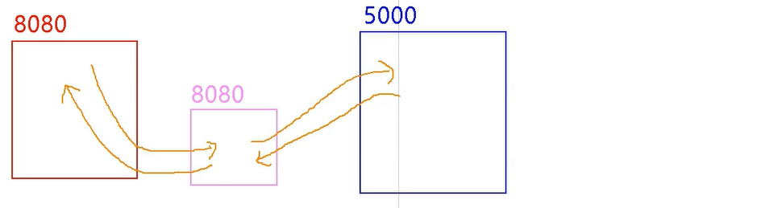

代理服务器（8080）和服务器（5000）打交道不需要AJAX，因为AJAX是前端技术。两台服务器之间通信使用HTTP请求就可以了。

- **代理服务器的开启**

1、nginx 利用 nginx 开启，比较复杂

2、**vue-cli**（本节课使用）

### Vue-CLI 配置代理1

Vue-CLI开启代理服务器

> 官方文档：https://cli.vuejs.org/zh/config/#devserver-proxy

```
module.exports = {
  devServer: {
    proxy: 'http://localhost:4000'
  }
}
```


目前来说在我们的电脑上有三台服务器，① 开在本机8080端口号上的服务器（vue网页），是vue-cli帮忙开的 ② server1 ③ server2

待会配置完之后电脑上又会多出一台，端口号是8080（代理服务器）

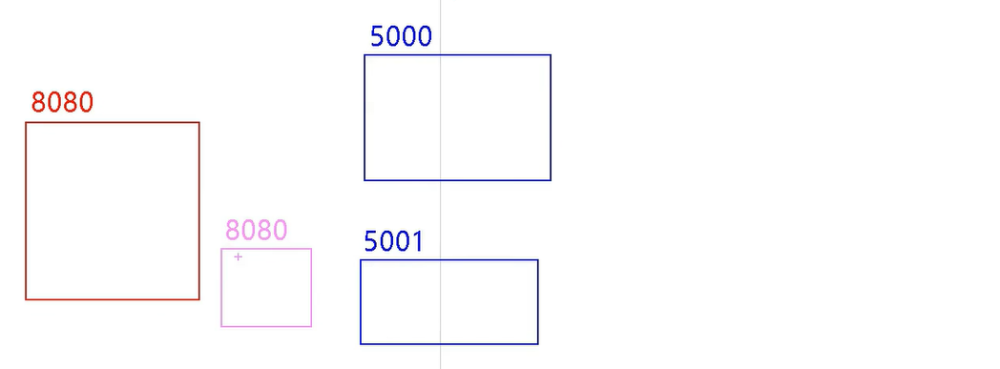

- 具体使用（vue.config.js中）

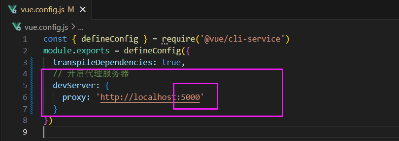

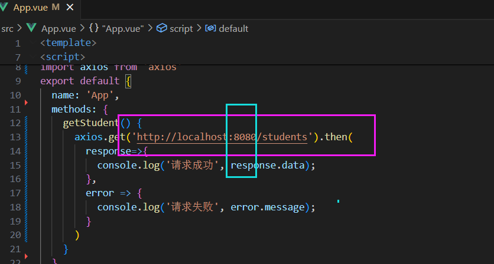


**<font color="red">注意事项/问题</font>**

① 代理服务器不会把所有的请求转发给5000（当请求的数据代理服务器有、8080本来就有）

- 说明

刚才说过 vue-cli 帮我们开了一个服务器  http://localhost:8080/ （网页），注意public 文件夹是我们的根目录，8080服务器下到底有什么，就看 public 文件夹下有什么。

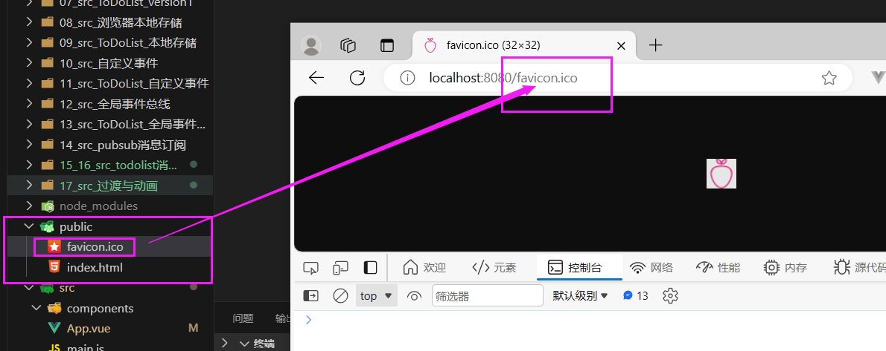

假如当前public文件夹下有students，那么代理服务器就不会把请求给5000。

② 不能配置多个代理

当前的代理服务器只能 把数据转发给 5000 不能转发给别的。

### Vue-CLI 配置代理2

> 官方文档：https://cli.vuejs.org/zh/config/#devserver-proxy

```
module.exports = {
  devServer: {
    proxy: {
      '/api': {
        target: '<url>',
        ws: true,
        changeOrigin: true
      },
// 注意注意注意注意注意注意注意注意注意 下面的部分是上面部分精简而来的
      '/foo': {
        target: '<other_url>'
      }
    }
  }
}
```

/api 是请求前缀。我们（ http://localhost:8080/）给代理服务器发送请求后，它会判断前缀是不是api，如果不是就不走代理，如果是就 走。这个api是可以改名字的，比如改成 /atguigu

target：如果前缀是api，目标地址是哪里

- 实例

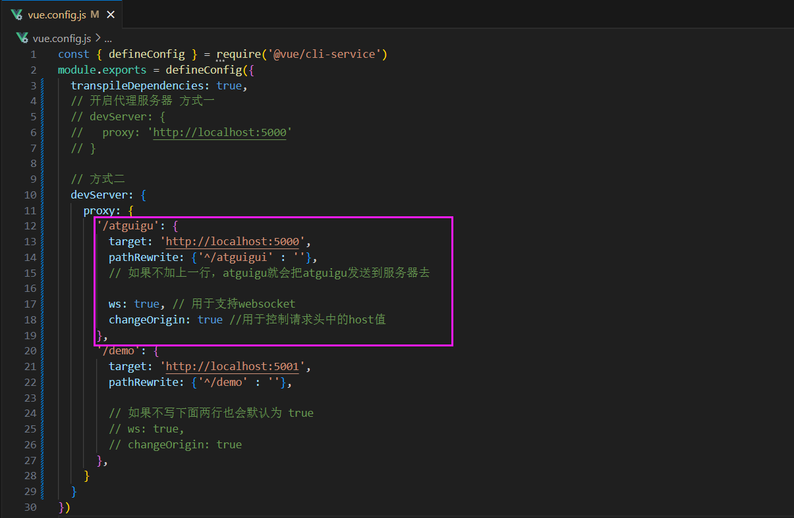

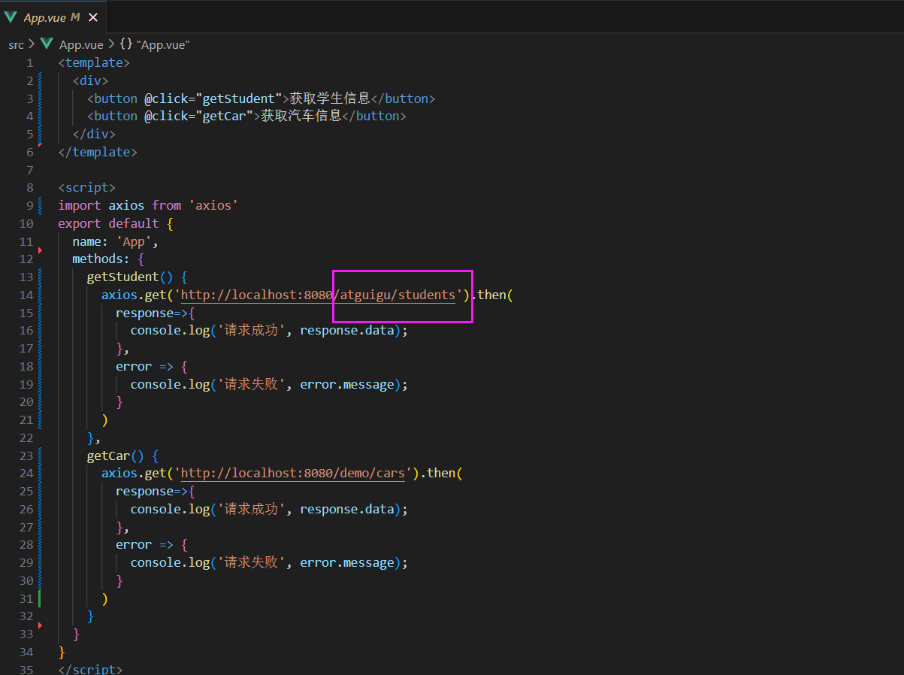


<font color="red">**VUE脚手架配置代理**</font>

**方法一**

在 vue.config.js 中添加如下配置：

```
devServer: {
  proxy: 'http://localhost:5000'
}
```

说明：

① 优点：配置简单，请求资源时直接发送给前端8080即可

② 缺点：不能配置多个代理，不能灵活控制请求是否走代理

③ 工作方式：如果按照上述配置代理，当请求了前端不存在的资源时，那么该请求会转发给服务器（优先匹配前端资源）

**方法二**

编写 vue.config.js 配置具体代理规则：

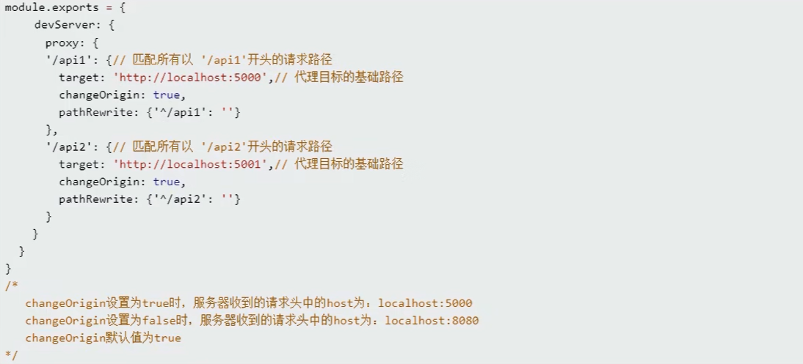

说明：

① 优点：可以配置多个代理，且可以灵活控制请求是否走代理

② 缺点：配置略微繁琐，请求资源时必须加前缀 http://localhost:8080/**atguigu**/students

### 案例: 用户搜索

<font color="red">**组件化编码流程（通用）**</font>

1.实现静态组件：抽取组件，使用组件实现静态页面效果

2.展示动态数据：

​       数据的类型、名称是什么？

​       数据保存在哪个组件？

3.交互——从绑定事件监听开始


- 实现

> github提供的API https://api.github.com/search/users?q=xxx
>
> github的后端工程师已经使用 cors 解决了跨域问题

静态组件

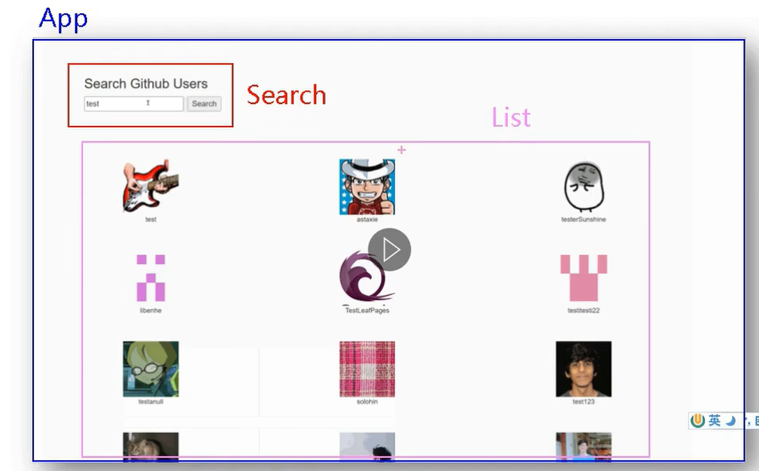

注意：引入 bootstrap.css（**公共的第三方库**）的方法 ①在src下新建文件夹assets (因为是import引入所以会进行严格检查，所以会报错) ② 在public在新建一个css文件夹，然后再 public/index.html 内引入。

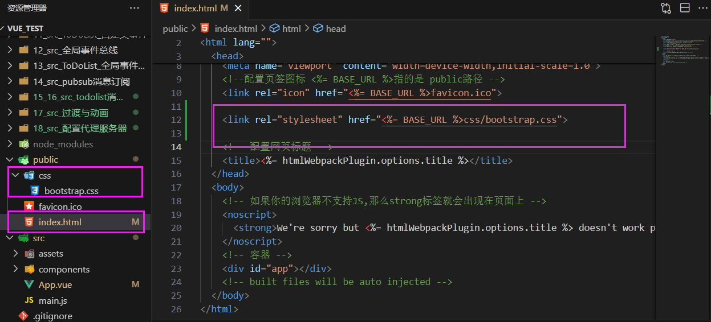


- 请求数据并展示

跨域问题：github的后端工程师已经使用 cors 解决了跨域问题

组件之间的通信：这里利用总线

- 完善功能

在最开始的页面 添加欢迎词

点击搜索之后 有加载中

**经分析，List组件有四种数据呈现：1欢迎界面 2加载界面 3用户界面 4失败界面**

 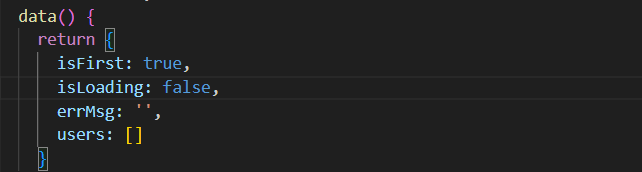

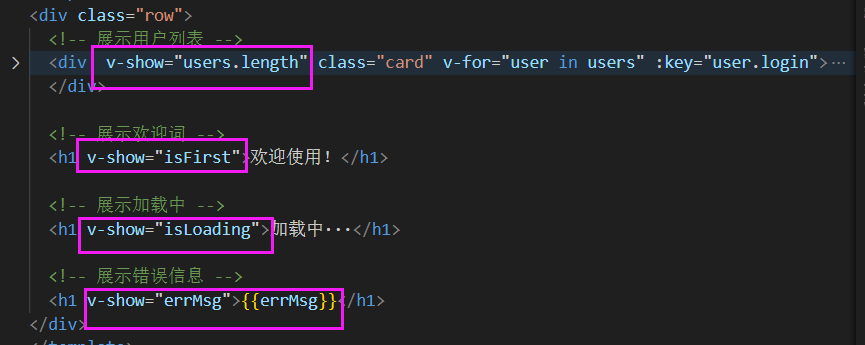

- ES6

 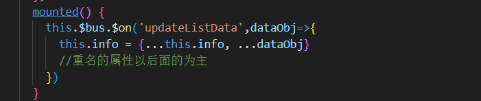

### vue-resource

（了解即可 axios用的更多）

vue-resource是一个发送 Ajax 请求库，之前说过xhr jQery axios fetch

这是一个vue的插件，所以使用方法为 Vue.use，使用完之后所有的 vm（vue实例） vc（vuecomponent实例）都有了这个插件

对XHR封装

- 实例

① npm i vue-resource

② Vue.use 注意这里肯定是写在 main.js里面的，因为只有这个文件中引入了Vue

③ 使用完之后所有的 vm（vue实例） vc（vuecomponent实例）都有了这个插件

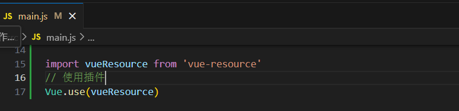

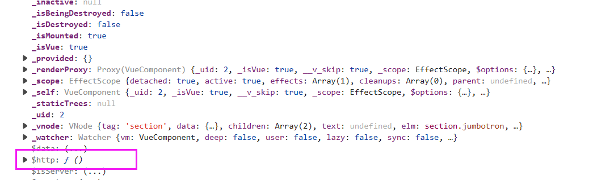

使用vue-resource：只需要把axios换成 vue-resource

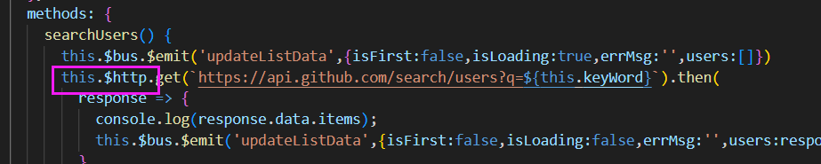

## 02 slot插槽

**效果一**

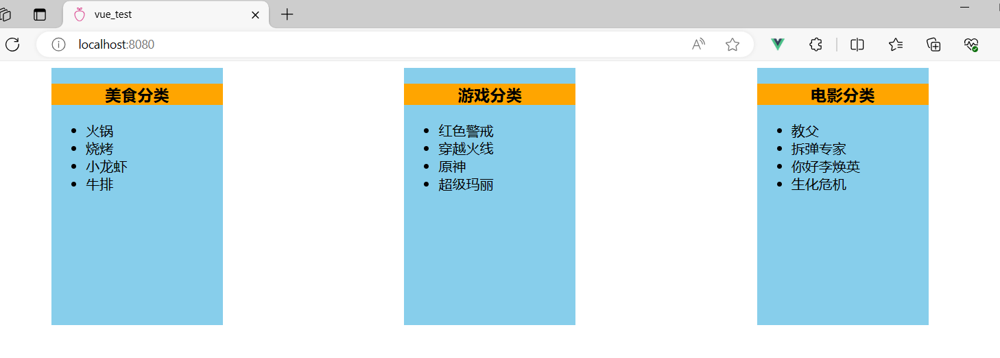

### 默认插槽

**效果二**

（默认插槽）

 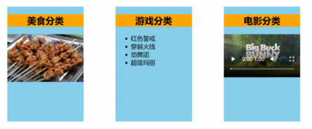

要实现这种方式，可以使用v-show，但是很麻烦

使用默认插槽

- App.vue

```html
<template>
  <div class="container">
    <MyCategory title="美食" >
      
    </MyCategory>

    <MyCategory title="游戏">
      <ul>
        <li v-for="(item,index) in games" :key="index">{{item}}</li>
      </ul>
    </MyCategory>

    <MyCategory title="电影">
      
    </MyCategory>
  </div>
</template>

<script>
import MyCategory from './components/MyCategory.vue'

export default {
  name: 'App',
  components: {MyCategory},
  data() {
    return {
      grill: require('./assets/grill.jpg'), 
      movie: require('./assets/movie.jpg'), 

      foods: ['火锅','烧烤','小龙虾','牛排'],
      games: ['红色警戒','穿越火线','原神','超级玛丽'],
      films: ['教父','拆弹专家','你好李焕英','生化危机']
    }
  },
}
</script>

<style>
  .container {
    display: flex;
    justify-content: space-around;
  }
</style>
```

- MyCategory

```html
<template>
  <div class="category">
    <h3>{{title}}分类</h3>
    <slot>我是一个默认值</slot>
  </div>
</template>

<script>  
export default {
  name: 'MyCategory',
  props: ['listData','title']
}
</script>

<style>
  .category {
    background-color: skyblue;
    width: 200px;
    height: 300px;
    overflow: hidden;
  }

  h3 {
    text-align: center;
    background-color: orange;
  }
  img {
    width: 100%;
  }
</style>
```

### 具名插槽

- 示例

name属性

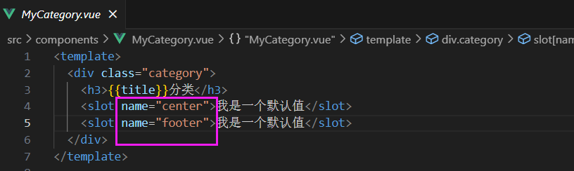

slot属性

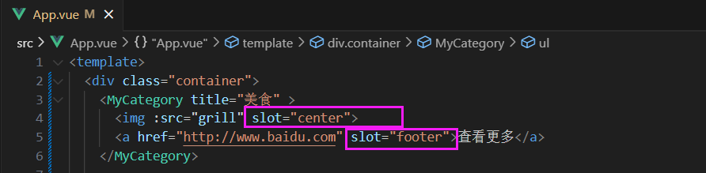

注意：如果使用 v-slot、和template（不会被解析成结构）：

```
<template v-slot:footer>
  <div class="foot">
    <a href="http://www.atguigu.com">经典</a>
    <a href="http://www.atguigu.com">热门</a>
    <a href="http://www.atguigu.com">推荐</a>
  </div>
</template>
```

### 作用域插槽

App组件时MyCategory的使用者，同时提供数据

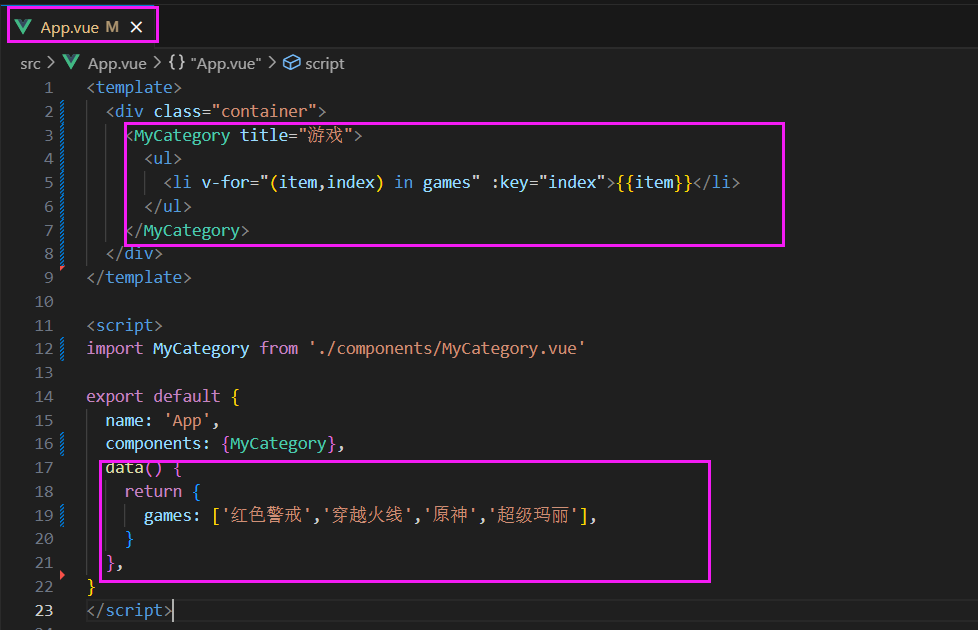

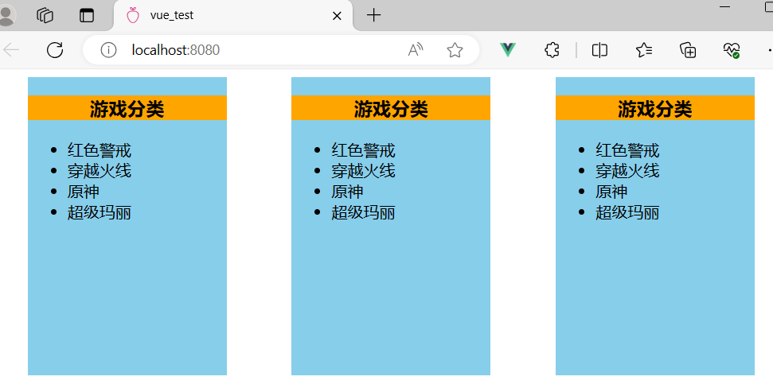

如果此时把data放去 MyCategory 组件，可以不用插槽就能实现。

- 新需求

相同的数据，但是展示的顺序（展示的顺序由使用者决定）不一样。


数据在MyCategory组件中，但是App中来设置（代码如下），就需要使用到作用域插槽。

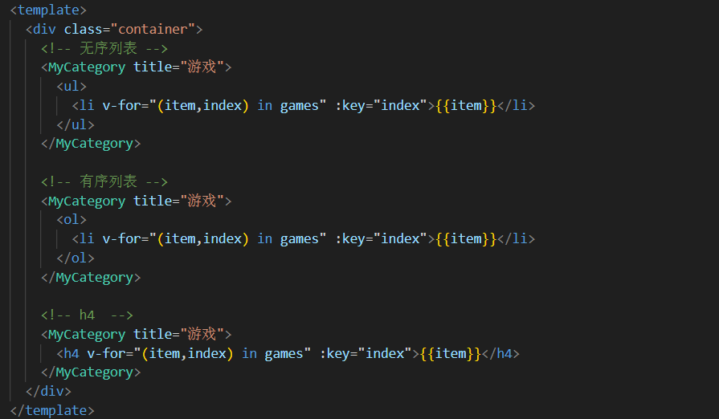

- 作用于插槽使用

App.vue这里支持解构

scope="{mygames}"

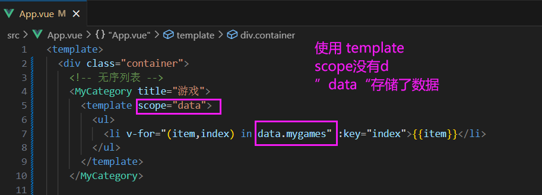

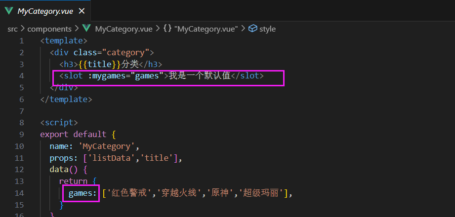

### slot总结

1、作用：让父组件可以向子组件指定位置插入HTML结构，也是一种组件间通信的方式，适用于父组件===>子组件。

2、分类：默认插槽、具名插槽、作用域插槽

**① 默认插槽**

```
父组件中
<Category>
  <div> html结构 </div>
</Category> 

子组件中
<template>
  <div> 
    <slot>插槽默认内容</slot>
  </div>
</template>
```

**② 具名插槽**

注意这里slot有两种写法

```
父组件中
<Category>
  <template slot='center'>
    <div> html结构1 </div>
  </template>
</Category> 

<Category>
  <template v-slot:'footer'>
    <div> html结构1 </div>
  </template>
</Category> 

子组件中
<template>
  <div> 
    <slot name="center">插槽默认内容</slot>
    <slot name="footer">插槽默认内容</slot>
  </div>
</template>
```

**③ 作用于插槽**

理解：数据在组件的自身，但根据 数据生成的结构 需要组件的使用者来决定。(games数据在Category组件中，但使用数据所遍历出来的结构由App组件决定)

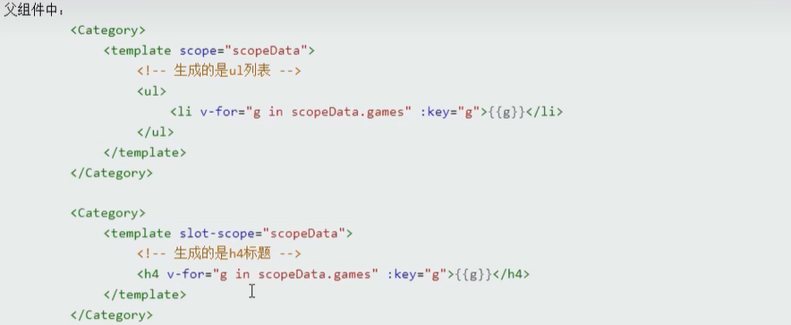


