# Vue 04 vuex

# 01 介绍

1、概念：专门在Vue中实现集中式状态（数据）管理的一个Vue插件，对vue应用中多个组件的共享状态进行集中式管理（读/写），也是一种组件间通信的方式，且适用于任意组件间通信。

2、什么时候使用Vuex

① 多个组件依赖于同一状态

② 来自不同组件的行为需要变更同—状态


**多组件共享数据——全局事件总线实现**

下图是BCD读到A中的数据

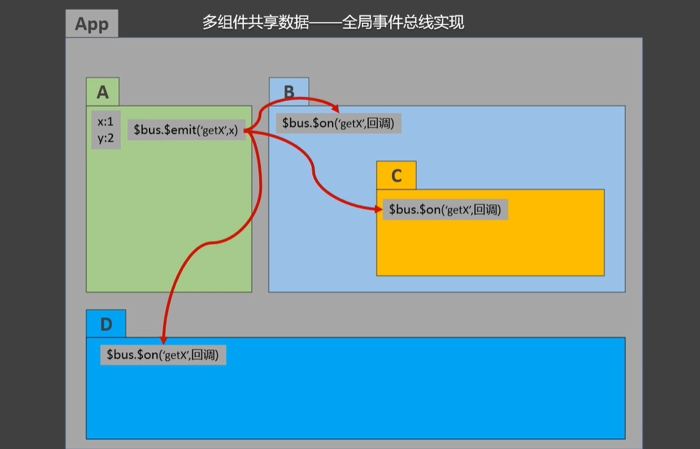

下图，所有人都可以 读、写 X

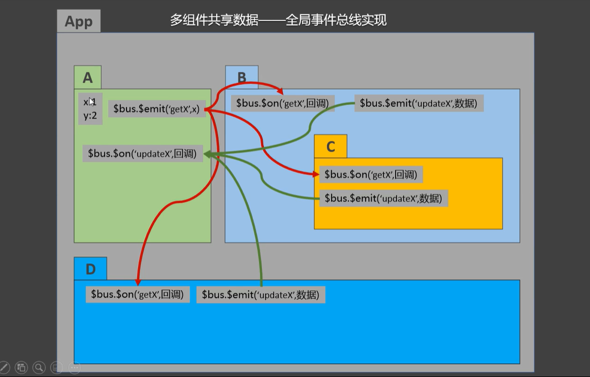

**多组件共享数据——VueX总线实现**

vuex不属于任何一个组件（A B C D App）

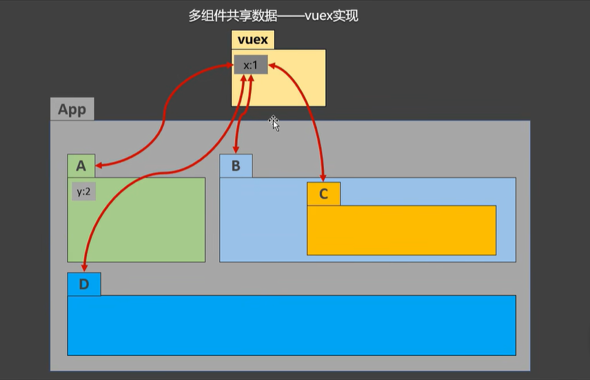

# 02 工作原理


action 本质是对象；mutation本质是对象；state 状态，等于数据。本质是一个对象。 **他们仨是被 store管理的。despatch、commit是store提供的。**需要让所有的VC都可以访问到 store

以下面的求和案例讲解：

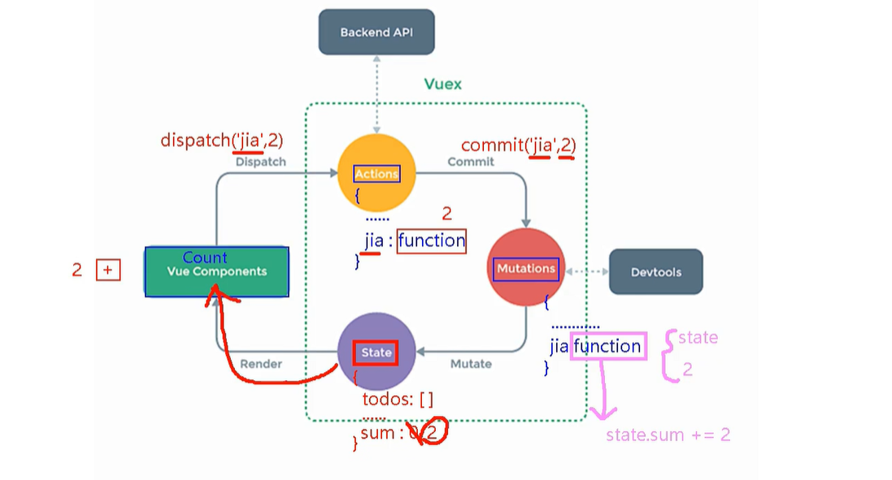

vue允许你可以直接调用mutations(action的作用是，如果除法的除数来自另一台服务器，那么在他这里发送请求)

vc：客人；Action服务员；Mutation后厨; State菜。 


## 使用

① npm i vuex

注意，在2022年2月，vue3成为了默认版本，也就是说 执行 npm i vue时安装的直接就是vue3。并且vue3 成为默认版本的同时，vuex也升级到了4版本。npm i vuex安装的是vuex4。 vuex4 只能在 vue3 上使用，如果我们在一个vue2项目中安装vuex4 就会报错。

**vue2中，要用vuex的3版本。vue3中，要用vuex的4版本。**视频教学中使用的是vue2所以要安装vuex3版本。```npm i vuex@3```

② Vue.use(Vuex)

在use了vuex之后，创建vm的时候就可以传入配置项 store了

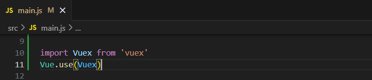

③ store

创建store

方法① src下创建文件夹 vuex，vuex文件夹张创建空白的 store.js 

方法② src下创建文件夹 store，store下创建空白 index.js


要先创建vuex实例，再创建store

④ vc==>store

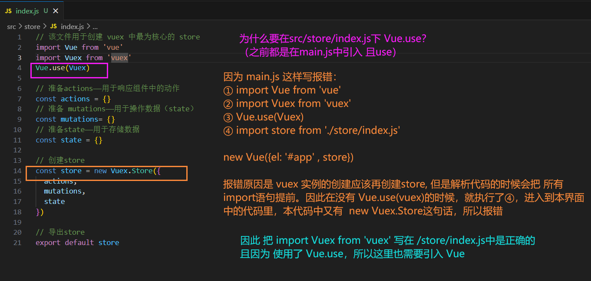

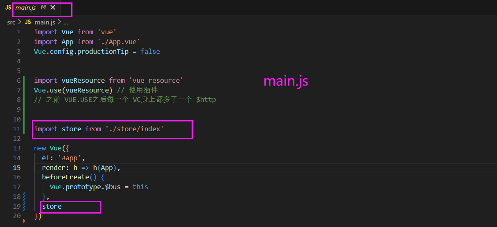

Q：为什么 这么配置就能保证组件能访问到？因为这个store作为 new Vue 的配置对象，我能理解 vm 可以访问到，但是所有 vc 是怎么访问到的？之前的全局总线配置在了 Vue.prototype 中所以 所有vc可以访问，这次是为什么？

感觉这一片比较好的解释了。https://blog.csdn.net/dyw3390199/article/details/115207165

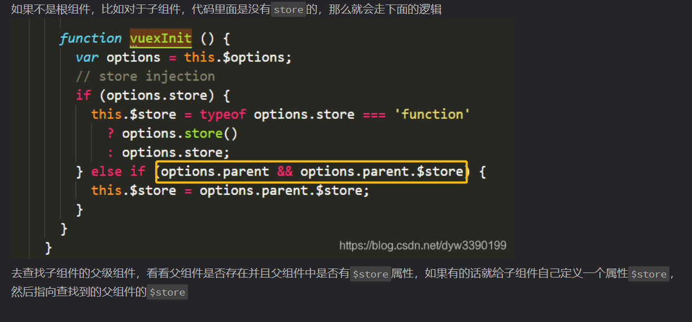

# 03 案例

## 求和,纯vue实现

### 补充HTML 

 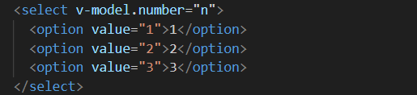

双向数据绑定，复选框的值 要通过value定义

- MyCount.vue

```html
<template>
	<div>
		<h1>当前求和为：{{sum}}</h1>

		<select v-model.number="n">
			<option value="1">1</option>
			<option value="2">2</option>
			<option value="3">3</option>
		</select>
   
		<button @click="increment">+</button>
	</div>
</template>

<script>
	export default {
		name:'MyCount',
		data() {
			return {
				n:1, //用户选择的数字
			}
		},
		methods: {
			increment(){
				this.sum += this.n
			},
			decrement(){
				this.sum -= this.n
			},
			incrementOdd(){
				if(this.sum % 2){
					this.sum += this.n
				}
			},
			incrementWait(){
				setTimeout(()=>{
					this.sum += this.n
				},500)
			},
		},
    watch: {
      n(value) {
        console.log(value);
      }
    }
	}
</script>
```

## vuex实现

配置好vuex、保证每一个VC身上都有store之后：

- 以加法为例

MyCount.vue

```html
<template>
	<div>
       <!-- 最后一步 使用修改之后的state。注意这里不用写this -->
		<h1>当前求和为：{{$store.state.sum}} </h1>

		<select v-model.number="n">
			<option value="1">1</option>
			<option value="2">2</option>
			<option value="3">3</option>
		</select>
		<button @click="increment">+</button>
	</div>
</template>

<script>  
	export default {
		name:'MyCount',
		data() {
			return {
				n:1, //用户选择的数字
        // ************************************************************
        // 步骤一 为了演示vuex，把本例中的 sum 放去了 /src/store/index.js
				// sum:0 当前的和
			}
		},
		methods: {
			increment(){
        this.$store.dispatch('jia', this.n)
        // ************************************************************
        // 步骤二 dispatch
        // （步骤三 去/src/store/index.js中让 actions 里面配置好函数）
				// this.sum += this.n
			}
	}
</script>

```

store/index.js

```javascript
import Vue from 'vue'
import Vuex from 'vuex'
Vue.use(Vuex)


const actions = {
  jia(context,value) {
    console.log('actions中的jia被调用了',context,value);
    context.commit('JIA',value) // 提交
    // 开发技巧 JIA写大写
  }
}

const mutations= {
  // 开发技巧 JIA写大写
  JIA(state, value){
    console.log('mutation中的JIA');
    state.sum += value
    console.log(state.sum );
  },
}

const state = {
  sum:0 //当前的和
}

export default new Vuex.Store({
  actions,
  mutations,
  state
})

```

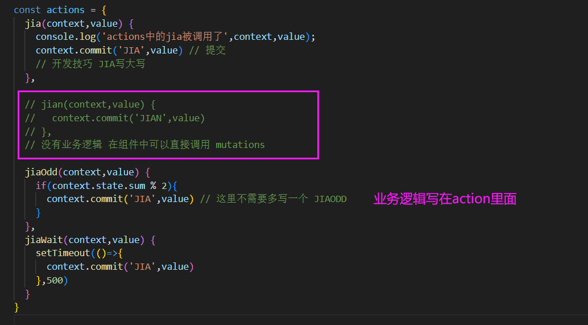

组件中直接调用commit和mutations对话：**注意这里需要大写**

 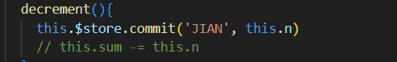
